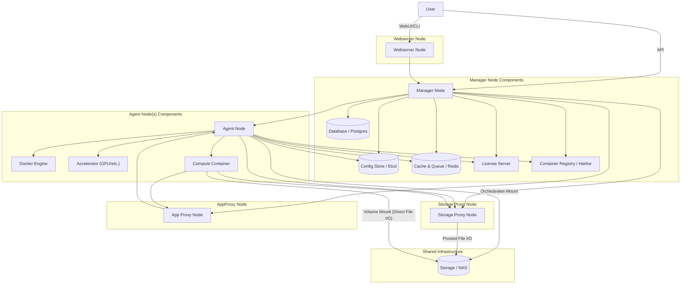
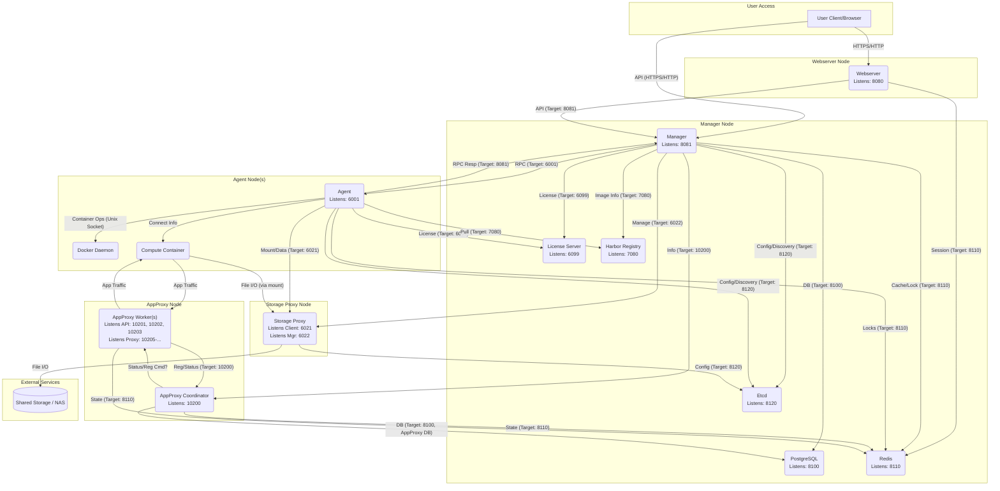

# Multi-node Setup

## 1. Introduction

This document provides step-by-step instructions for setting up the Backend.AI platform without using automated deployment tools. It assumes you have a basic understanding of Linux system administration, networking, containerization (Docker), and Python environments.

**Standard Configuration:**

A typical Backend.AI deployment consists of several specialized nodes:

* **Manager Node (1):** Hosts the core control plane (Manager), infrastructure services (PostgreSQL, Etcd, Redis), the License Server, and often the Container Registry (Harbor) and administrative UIs (Control Panel, FastTrack).
* **Webserver Node (1):** Hosts the user-facing Web UI (Webserver).
* **Storage Proxy Node (1):** Manages interactions with shared storage volumes.
* **AppProxy Node (1):** Routes traffic for applications running inside compute sessions (for example, Jupyter, SSH). Hosts Coordinator and Worker components.
* **Agent Nodes (Multiple):** The compute nodes where user sessions run. Each hosts an Agent service.

**Installation Overview:**

* **All Nodes:** Require Operating System Preparation (including Docker, Python, and Automatic Environment Activation).
* **Manager Node:** Hosts Infrastructure Services (Postgres, Etcd, Redis), Harbor, License Server, and the Manager service. Optional: Control Panel, FastTrack.
* **Webserver Node:** Hosts the Webserver service.
* **Storage Proxy Node:** Hosts the Storage Proxy service.
* **AppProxy Node:** Hosts the AppProxy Coordinator and Worker services.
* **Each Agent Node:** Hosts an Agent service.

**Target Audience:** System administrators and users comfortable with manual configuration of complex software stacks across multiple nodes.

## 2. Pre-Configuration Variables

Before starting the installation, carefully review and determine the values for the variables listed in the table below. These values represent your specific environment settings. You will need to **manually substitute** these values into configuration files (.toml, .yml, .json) and scripts (.sh) throughout this guide where indicated (for example, replace `<MANAGER_NODE_IP>` with the actual IP address, `<POSTGRES_PASSWORD>` with your chosen password). Keep a record of your chosen values.

| Variable Name                                  | Description                                                                    | Example Value                                       |
| ---------------------------------------------- | ------------------------------------------------------------------------------ | --------------------------------------------------- |
| **User and Group**                             |                                                                                |                                                     |
| `BAI_USER`                                     | Dedicated username for running Backend.AI services                             | `bai`                                               |
| `BAI_GROUP`                                    | Dedicated group name for running Backend.AI services                           | `bai`                                               |
| `BAI_USER_UID`                                 | Consistent User ID (UID) across all nodes                                      | `1100`                                              |
| `BAI_USER_GID`                                 | Consistent Group ID (GID) across all nodes                                     | `1100`                                              |
| `BAI_HOME`                                     | Home directory of the BAI\_USER                                                | `/home/bai`                                         |
| **Node IPs / Hostnames**                       |                                                                                |                                                     |
| `MANAGER_NODE_IP`                              | IP address or resolvable hostname of the Manager node                          | `10.20.30.10`                                       |
| `WEBSERVER_NODE_IP`                            | IP address or resolvable hostname of the Webserver node                        | `10.20.30.11`                                       |
| `STORAGE_PROXY_NODE_IP`                        | IP address or resolvable hostname of the Storage Proxy node                    | `10.20.30.12`                                       |
| `APPPROXY_NODE_IP`                             | IP address or resolvable hostname of the AppProxy node                         | `10.20.30.13`                                       |
| `AGENT1_NODE_IP`                               | IP address or resolvable hostname of Agent node 1                              | `10.20.30.31`                                       |
| `AGENT2_NODE_IP`                               | IP address or resolvable hostname of Agent node 2 (add more as needed)         | `10.20.30.32`                                       |
| `REGISTRY_NODE_IP`                             | Node hosting the Container Registry (Harbor), often Manager node               | `10.20.30.10`                                       |
| `LICENSE_SERVER_NODE_IP`                       | Node hosting the License Server, usually Manager node                          | `10.20.30.10`                                       |
| `POSTGRES_NODE_IP`                             | Node hosting PostgreSQL, usually Manager node                                  | `10.20.30.10`                                       |
| `ETCD_NODE_IP`                                 | Node hosting Etcd, usually Manager node                                        | `10.20.30.10`                                       |
| `REDIS_NODE_IP`                                | Node hosting Redis, usually Manager node                                       | `10.20.30.10`                                       |
| `CP_NODE_IP`                                   | Node hosting Control Panel (Optional), often Manager node                      | `10.20.30.10`                                       |
| `FT_NODE_IP`                                   | Node hosting FastTrack (Optional), often Manager node                          | `10.20.30.10`                                       |
| **Service Ports**                              |                                                                                |                                                     |
| `POSTGRES_PORT`                                | Host port mapping for PostgreSQL                                               | `8100`                                              |
| `ETCD_PORT`                                    | Host port mapping for Etcd                                                     | `8120`                                              |
| `REDIS_PORT`                                   | Host port mapping for Redis                                                    | `8110`                                              |
| `HARBOR_PORT`                                  | Host port mapping for Harbor (HTTP)                                            | `7080`                                              |
| `LICENSE_SERVER_PORT`                          | Host port for License Server                                                   | `6099`                                              |
| `MANAGER_API_PORT`                             | Host port for Manager API                                                      | `8081`                                              |
| `STORAGE_PROXY_CLIENT_PORT`                    | Host port for Storage Proxy (Client/Agent facing)                              | `6021`                                              |
| `STORAGE_PROXY_MANAGER_PORT`                   | Host port for Storage Proxy (Manager facing)                                   | `6022`                                              |
| `AGENT_RPC_PORT`                               | Host port for Agent RPC listener                                               | `6001`                                              |
| `WEBSERVER_PORT`                               | Host port for Webserver                                                        | `8080`                                              |
| `APPPROXY_COORD_PORT`                          | Host port for AppProxy Coordinator                                             | `10200`                                             |
| `APPPROXY_WORKER_API_PORT_INTERACTIVE`         | Host port for AppProxy Interactive Worker API (must be unique)                 | `10201`                                             |
| `APPPROXY_WORKER_API_PORT_INFERENCE`           | Host port for AppProxy Inference Worker API (must be unique)                   | `10202`                                             |
| `APPPROXY_WORKER_API_PORT_TCP`                 | Host port for AppProxy TCP Worker API (must be unique)                         | `10203`                                             |
| `APPPROXY_WORKER_PROXY_START_PORT_INTERACTIVE` | Start of proxy port range for Interactive Worker (unique range per worker)     | `10205`                                             |
| `APPPROXY_WORKER_PROXY_END_PORT_INTERACTIVE`   | End of proxy port range for Interactive Worker (unique range per worker)       | `10500`                                             |
| `CP_PORT`                                      | Host port for Control Panel (HTTPS)                                            | `8443`                                              |
| `FT_PORT`                                      | Host port for FastTrack (HTTP)                                                 | `9500`                                              |
| **Passwords and Secrets**                      | **Choose strong, unique values!**                                              |                                                     |
| `POSTGRES_PASSWORD`                            | Password for the main PostgreSQL user                                          | `<your-strong-postgres-password>`                   |
| `APPPROXY_DB_PASSWORD`                         | Password for the AppProxy PostgreSQL user                                      | `<your-strong-appproxy-db-password>`                |
| `FASTTRACK_DB_PASSWORD`                        | Password for the FastTrack internal PostgreSQL user (if used)                  | `<your-strong-fasttrack-db-password>`               |
| `REDIS_PASSWORD`                               | Password for Redis                                                             | `<your-strong-redis-password>`                      |
| `HARBOR_ADMIN_PASSWORD`                        | Password for the Harbor 'admin' user                                           | `<your-strong-harbor-admin-password>`               |
| `HARBOR_BAI_USER_PASSWORD`                     | Password for the 'bai' user created within Harbor                              | `<your-strong-harbor-bai-user-password>`            |
| `APPPROXY_JWT_SECRET`                          | Secret key for AppProxy JWT generation                                         | `<generate-a-strong-random-secret>`                 |
| `APPPROXY_API_SECRET`                          | Shared key between Manager and AppProxy Coordinator                            | `<generate-a-strong-random-secret-shared-key>`      |
| `APPPROXY_PERMIT_HASH_SECRET`                  | Secret key for AppProxy permit hashing                                         | `<generate-a-strong-random-secret>`                 |
| `FASTTRACK_JWT_SECRET`                         | Secret key for FastTrack JWT (if used, must match Webserver config)            | `<generate-a-strong-random-secret>`                 |
| `STORAGE_PROXY_JWT_SECRET`                     | Secret key for Storage Proxy client JWT generation                             | `<generate-a-strong-random-secret>`                 |
| `STORAGE_PROXY_MANAGER_TOKEN`                  | Secret key for Manager to authenticate with Storage Proxy                      | `<generate-a-strong-random-secret>`                 |
| `CP_ADMIN_PASSWORD`                            | Control Panel admin password (match Manager admin for simplicity)              | `<match-superadmin-password>`                       |
| `FLOWER_ADMIN_PASSWORD`                        | Password for Celery Flower UI (Optional)                                       | `<generate-a-strong-random-password>`               |
| **Paths and Directories**                      |                                                                                |                                                     |
| `VFROOT_BASE_PATH`                             | Base directory for shared storage volume mounts (on SP/Agent nodes)            | `/vfroot`                                           |
| `PYTHON_VERSION`                               | Version of the standalone Python build being used                              | `3.12.9`                                            |
| `PYTHON_INSTALL_BASE_DIR`                      | Base directory for Python installations (within BAI\_HOME)                     | `${BAI_HOME}/.static-python`                        |
| `SERVICE_BASE_DIR`                             | Base directory for service installations (e.g., manager, agent)                | `${BAI_HOME}`                                       |
| `DATA_BASE_DIR`                                | Base directory for persistent data storage (e.g., DB, Redis)                   | `${BAI_HOME}/.data`                                 |
| **Logical Names**                              |                                                                                |                                                     |
| `STORAGE_PROXY_NODE_ID`                        | Logical identifier for the Storage Proxy node (used in Manager config)         | `sp1`                                               |
| `DEFAULT_VOLUME_NAME`                          | Logical name for the primary shared storage volume                             | `nas`                                               |
| `REGISTRY_SCHEME`                              | URL scheme for Harbor                                                          | `http`                                              |
| `REGISTRY_URL`                                 | Full URL for Harbor                                                            | `http://10.20.30.10:7080`                           |
| `REGISTRY_FQDN`                                | Host:Port format for Harbor (used in Docker config)                            | `10.20.30.10:7080`                                  |
| `HARBOR_BAI_USERNAME`                          | Username created within Harbor for Backend.AI access                           | `bai`                                               |
| `HARBOR_PROJECT_COMPUTE`                       | Harbor project name for compute images                                         | `bai`                                               |
| `HARBOR_PROJECT_USER`                          | Harbor project name for user-related images                                    | `bai-user`                                          |
| `DEFAULT_COMPUTE_IMAGE`                        | Full path to the default compute kernel image                                  | `10.20.30.10:7080/bai/python:latest`                |
| `DEFAULT_FILEBROWSER_IMAGE`                    | Full path to the default file browser image                                    | `10.20.30.10:7080/bai/filebrowser:latest`           |
| `DEFAULT_IMPORTER_IMAGE`                       | Full path to the default importer image                                        | `10.20.30.10:7080/bai/importer:latest`              |
| **Super Admin Credentials**                    |                                                                                |                                                     |
| `SUPERADMIN_USERNAME`                          | Username for the primary Backend.AI administrator                              | `admin`                                             |
| `SUPERADMIN_EMAIL`                             | Email address for the administrator                                            | `admin@example.com`                                 |
| `SUPERADMIN_PASSWORD`                          | Password for the administrator                                                 | `<your-strong-superadmin-password>`                 |
| `SUPERADMIN_ACCESS_KEY`                        | API Access Key for the administrator (generate unique)                         | `<generate-a-unique-access-key>`                    |
| `SUPERADMIN_SECRET_KEY`                        | API Secret Key for the administrator (generate unique)                         | `<generate-a-unique-secret-key>`                    |
| **Example User Credentials**                   | **Context:** Optional, for testing                                             |                                                     |
| `USER_USERNAME`                                | Username for a standard user                                                   | `user`                                              |
| `USER_EMAIL`                                   | Email address for the standard user                                            | `user@example.com`                                  |
| `USER_PASSWORD`                                | Password for the standard user                                                 | `<your-strong-user-password>`                       |
| `USER_ACCESS_KEY`                              | API Access Key for the standard user (generate unique)                         | `<generate-a-unique-access-key>`                    |
| `USER_SECRET_KEY`                              | API Secret Key for the standard user (generate unique)                         | `<generate-a-unique-secret-key>`                    |
| **UUIDs**                                      | **Action:** Generate using `uuidgen`                                           |                                                     |
| `DEFAULT_PROJECT_UUID`                         | UUID for the default user group/project                                        | `<generate-uuid-for-default-project>`               |
| `MODEL_STORE_PROJECT_UUID`                     | UUID for the model store project                                               | `<generate-uuid-for-model-store>`                   |
| `SUPERADMIN_USER_UUID`                         | UUID for the superadmin user account                                           | `<generate-uuid-for-superadmin>`                    |
| `USER_USER_UUID`                               | UUID for the example user account (if created)                                 | `<generate-uuid-for-user>`                          |
| **Database Names/Users**                       | **Note:** Usually fixed, but configurable                                      |                                                     |
| `BACKEND_DB_NAME`                              | Database name for the Manager service                                          | `backend`                                           |
| `BACKEND_DB_USER`                              | Database user for the Manager service (Postgres superuser often used)          | `postgres`                                          |
| `APPPROXY_DB_NAME`                             | Database name for the AppProxy service                                         | `wsproxy`                                           |
| `APPPROXY_DB_USER`                             | Database user for the AppProxy service                                         | `wsproxy`                                           |
| `FASTTRACK_DB_NAME`                            | Database name for the internal FastTrack service                               | `workflow`                                          |
| `FASTTRACK_DB_USER`                            | Database user for the internal FastTrack service                               | `workflow`                                          |
| **Control Panel (Optional)**                   |                                                                                |                                                     |
| `CP_VERSION`                                   | Version of the Control Panel archive/images                                    | `25.03.1`                                           |
| `CP_NODE_IP`                                   | IP address or hostname of the node hosting Control Panel (often Manager Node)  | `10.20.30.10`                                       |
| `CP_PORT`                                      | Host port for accessing the Control Panel UI (HTTPS)                           | `8443`                                              |
| `CP_ALLOWED_HOSTS`                             | Comma-separated list of allowed hostnames/IPs for Control Panel Django app     | `*` or `cp.example.com,10.20.30.10`                 |
| `CP_CSRF_TRUSTED_ORIGINS`                      | Comma-separated list of trusted origins (scheme+host+port) for CSRF            | `https://10.20.30.10:8443`                          |
| `CP_TECHNICAL_SUPPORT_DATE`                    | Technical support expiration date shown in the UI                              | `2025-12-31T23:59:59Z`                              |
| `CP_ARCHIVE_PATH`                              | Full path to the downloaded Control Panel `.zip` archive                       | `/path/to/control-panel-prod-25.03.1.zip`           |
| `CP_ADMIN_PASSWORD`                            | Control Panel admin password (recommend matching `$SUPERADMIN_PASSWORD`)       | `<match-superadmin-password>`                       |
| **FastTrack (Optional)**                       |                                                                                |                                                     |
| `FT_VERSION`                                   | Version of the FastTrack archive/images                                        | `25.04.0`                                           |
| `FT_NODE_IP`                                   | IP address or hostname of the node hosting FastTrack (often Manager Node)      | `10.20.30.10`                                       |
| `FT_PORT`                                      | Host port for accessing the FastTrack UI (HTTP)                                | `9500`                                              |
| `FT_ALLOWED_HOSTS`                             | Comma-separated list of allowed hostnames/IPs for FastTrack Django app         | `*` or `fasttrack.example.com,10.20.30.10`          |
| `FT_ADVERTISE_URL`                             | Publicly accessible URL of the FastTrack service (used for callbacks)          | `http://10.20.30.10:9500`                           |
| `FT_DJANGO_SECRET_KEY`                         | Internal secret key for FastTrack's Django framework                           | `<generate-a-very-strong-random-django-secret>`     |
| `FASTTRACK_JWT_SECRET`                         | Secret key for JWT between FastTrack and Webserver (must match Webserver conf) | `<generate-a-strong-random-secret>`                 |
| `FASTTRACK_DB_NAME`                            | Database name for FastTrack's internal PostgreSQL                              | `workflow`                                          |
| `FASTTRACK_DB_USER`                            | Database user for FastTrack's internal PostgreSQL                              | `workflow`                                          |
| `FASTTRACK_DB_PASSWORD`                        | Password for FastTrack's internal PostgreSQL user                              | `<your-strong-fasttrack-db-password>`               |
| `FT_ARCHIVE_PATH`                              | Full path to the downloaded FastTrack `.tar.gz` archive                        | `/path/to/backend.ai-fasttrack-25.04.0-...tar.gz`   |
| **Zabbix (Optional)**                          |                                                                                |                                                     |
| `ZABBIX_SERVER_NODE_IP`                        | IP address or hostname of the node hosting the Zabbix Server                   | `10.20.30.10`                                       |
| `ZABBIX_SERVER_PORT`                           | Listening port for Zabbix Agents to connect to the Server                      | `10051`                                             |
| `ZABBIX_WEB_PORT`                              | Host port for accessing the Zabbix Web UI (HTTP)                               | `9010`                                              |
| `ZABBIX_DB_PASSWORD`                           | Password for Zabbix's internal PostgreSQL user (`zabbix`)                      | `<your-strong-zabbix-db-password>`                  |
| `ZABBIX_ADMIN_PASSWORD`                        | Password for the Zabbix Web UI 'Admin' user                                    | `<your-strong-zabbix-admin-password>`               |
| **Graylog (Optional)**                         |                                                                                |                                                     |
| `GRAYLOG_NODE_IP`                              | IP address or hostname of the node hosting Graylog Server                      | `10.20.30.10`                                       |
| `GRAYLOG_PORT`                                 | Host port for accessing the Graylog Web UI (HTTP)                              | `9000`                                              |
| `GRAYLOG_PASSWORD_SECRET`                      | Secret key used by Graylog internally (>= 16 chars)                            | `<generate-a-long-random-secret-at-least-16-chars>` |
| `GRAYLOG_ADMIN_PASSWORD`                       | Password for the Graylog Web UI 'admin' user                                   | `<your-strong-graylog-admin-password>`              |
| `GRAYLOG_OPENSEARCH_PASSWORD`                  | Initial admin password for the internal OpenSearch service                     | `<your-strong-opensearch-password>`                 |
| `GRAYLOG_SYSLOG_UDP_PORT`                      | UDP port on Graylog node for receiving syslog messages                         | `5140`                                              |

**Prerequisites:**

* **Operating System:** A recent Linux distribution (Ubuntu 20.04 LTS or later recommended).
* **User Privileges:** Sudo or root access is required on each node.
* **Networking:** All nodes must be network-reachable using the IPs/hostnames defined above. Firewalls must allow traffic on the defined service ports between relevant nodes. Ensure DNS or `/etc/hosts` is configured correctly on all nodes.
* **Basic Tools:** `curl`, `tar`, `unzip`, `openssl`, `uuidgen`, text editor installed on relevant nodes.
* **NVIDIA GPU Nodes:** If you have nodes with NVIDIA GPUs, ensure the NVIDIA driver and the `nvidia-container-toolkit` package are installed _before_ proceeding with Docker setup on those nodes.
* **Artifacts:** Access to Backend.AI installation packages (Python wheels, Docker images/archives, binaries) provided by Lablup, Inc.

## 3. System Architecture & Network Communication

### 3.1 System Architecture Overview (Simplified)



### 3.2 Network Communication Diagram

This diagram illustrates the primary communication paths and target ports between different Backend.AI components.



## 4. Operating System Preparation (**All Nodes**)

> **Applies to:**
> \
> Every server (Manager, Webserver, Storage Proxy, AppProxy, Agent nodes).

These steps must be performed on **every** server node.

### 4.1. Install Docker Engine

1.  **Install Prerequisites:**
    \
    Run the following command to update package lists and install necessary packages for adding repositories securely.

    
    ```bash
    sudo apt update
    sudo apt install -y ca-certificates curl
    ```
    
2.  **Add Docker's Official GPG Key:**
    \
    Download Docker's official GPG key to verify package integrity.

    > **Note:** Skip this step if you are installing Docker from an offline repository mirror.

    
    ```bash
    sudo install -m 0755 -d /etc/apt/keyrings
    sudo curl -fsSL https://download.docker.com/linux/ubuntu/gpg -o /etc/apt/keyrings/docker.asc
    sudo chmod a+r /etc/apt/keyrings/docker.asc
    ```
    
3.  **Set up the Docker Repository:**
    \
    Add Docker's official repository to your system's package sources.

    > **Note:** Skip this step if you are installing Docker from an offline repository mirror.

    
    ```bash
    echo \
      "deb [arch=$(dpkg --print-architecture) signed-by=/etc/apt/keyrings/docker.asc] https://download.docker.com/linux/ubuntu \
      $(. /etc/os-release && echo "$VERSION_CODENAME") stable" | \
      sudo tee /etc/apt/sources.list.d/docker.list > /dev/null
    sudo apt update
    ```
    
4.  **Install Docker Packages:**
    \
    Install the Docker Engine, command-line interface (CLI), containerd runtime, and useful plugins.

    
    ```bash
    # IMPORTANT: On nodes with NVIDIA GPUs, ensure the 'nvidia-container-toolkit'
    # package is installed *before* running this command.
    sudo apt install -y docker-ce docker-ce-cli containerd.io docker-buildx-plugin docker-compose-plugin docker-ce-rootless-extras
    ```
    

    > **Note:** For offline installation using pre-downloaded `.deb` files, navigate to the directory containing the files and run: `sudo dpkg -i /path/to/docker/*.deb`. You might need to install dependencies manually first (`sudo apt --fix-broken install`).
5.  **Create/Update Base Docker Daemon Configuration:**
    \
    Configure the Docker daemon. Using a text editor with `sudo` privileges (like `sudo nano` or `sudo vim`), create or edit the file `/etc/docker/daemon.json`. Add the following content, replacing `<REGISTRY_FQDN>` with the actual value you defined in Section 2 (for example, `10.20.30.10:7080`). This allows Docker to connect to your potentially insecure local Harbor registry.

    > **File:**
    > `/etc/docker/daemon.json`

    
    ```json
    {
        "insecure-registries": [
            "<REGISTRY_FQDN>"
        ],
        "exec-opts": [
            "native.cgroupdriver=cgroupfs"
        ],
        "icc": false,
        "data-root": "/var/lib/docker"
    }
    ```
    

    * **Replace `<REGISTRY_FQDN>`** with the actual hostname and port of your Harbor registry (for example, `10.20.30.10:7080`).
    * Set `"data-root"` if you need Docker to store its data (images, volumes, containers) in a different location (for instance, on a separate, larger disk mounted at `/data/docker`). Ensure the specified directory exists before restarting Docker.
6.  **Configure NVIDIA Runtime:**

    > **Applies only to:**
    > \
    > Nodes with NVIDIA GPUs.

    * **Prerequisite:** Ensure the `nvidia-container-toolkit` package is installed.
    *   Run the following command. This command automatically detects the Docker installation and modifies `/etc/docker/daemon.json` to register the NVIDIA container runtime, allowing Docker containers to access GPUs.

        
        ```bash
        sudo nvidia-ctk runtime configure --runtime=docker
        ```
        
7.  **Restart Docker Service:**
    \
    Apply the configuration changes by restarting and enabling the Docker service.

    
    ```bash
    sudo systemctl restart docker
    sudo systemctl enable docker # Ensure Docker starts on boot
    sudo systemctl status docker # Verify the service is active (running)
    # On GPU nodes, verify the NVIDIA runtime is registered:
    # docker info | grep -i runtime
    # You should see 'nvidia' listed among the runtimes.
    ```
    

### 4.2. Create Backend.AI Operation User

> **Applies to:**
> \
> All nodes.

It's best practice to run Backend.AI services under a dedicated, non-root user for security. Create this user consistently across **all nodes** involved in the cluster. Use the `$BAI_USER`, `$BAI_GROUP`, `$BAI_USER_UID`, `$BAI_USER_GID` variables defined in Section 2.

1.  **Create Group and User:**
    \
    Execute these commands on each node to create the group and user with specific UIDs/GIDs. Consistent IDs are important for shared filesystem permissions.

    
    ```bash
    # Create the group with the specified GID
    sudo groupadd -g "$BAI_USER_GID" "$BAI_GROUP"
    # Create the user with the specified UID, GID, home directory (-m), and default shell
    sudo useradd -u "$BAI_USER_UID" -g "$BAI_USER_GID" -m -s /bin/bash "$BAI_USER"
    # Set a strong password for the new user when prompted
    echo "Set password for user $BAI_USER:"
    sudo passwd "$BAI_USER"
    # Add the user to the 'sudo' group (optional, grants admin privileges - use cautiously)
    sudo usermod -aG sudo "$BAI_USER"
    # Add the user to the 'docker' group to allow interaction with the Docker daemon without sudo
    sudo usermod -aG docker "$BAI_USER"
    ```
    
2.  **Configure SSH Key Access (Optional but Recommended):**
    \
    This allows passwordless SSH login for the `$BAI_USER`, which simplifies management tasks across nodes (like copying files or running commands remotely).

    > **Run as:**
    > \
    > The `$BAI_USER` user on each node. You can switch to the user temporarily using `sudo -iu "$BAI_USER"`.

    
    ```bash
    # Switch to the BAI_USER
    sudo -iu "$BAI_USER"

    # Create the .ssh directory and set correct permissions
    mkdir -p ~/.ssh && chmod 700 ~/.ssh

    # Add the public key of the machine you want to connect *from*
    # Replace <your-public-ssh-key-content> with the actual public key string (e.g., content of id_rsa.pub)
    echo "<your-public-ssh-key-content>" >> ~/.ssh/authorized_keys

    # Set correct permissions for the authorized_keys file
    chmod 600 ~/.ssh/authorized_keys

    # Exit back to your original user session
    exit
    ```
    

    * Repeat this on all nodes where you want passwordless access _for_ the `$BAI_USER`. The public key should belong to the user/machine you'll be initiating the SSH connection _from_.

### 4.3. Set Resource Limits

> **Applies to:**
> \
> All nodes.

Adjust system resource limits for file handles and processes on **all nodes** to prevent potential issues under load. Use the `$BAI_USER` variable defined in Section 2.

1.  **Configure User Limits:** Using a text editor with `sudo` privileges, create the file `/etc/security/limits.d/99-backend-ai.conf`. This file defines resource limits for specific users or groups. Add the following content, replacing `${BAI_USER}` with the actual username you chose (for example, `bai`).

    > **File:**
    > `/etc/security/limits.d/99-backend-ai.conf`

    
    ```ini
    # /etc/security/limits.d/99-backend-ai.conf
    # Increase limits for root user
    root      hard  nofile    512000
    root      soft  nofile    512000
    root      hard  nproc     65536
    root      soft  nproc     65536
    root      hard  msgqueue  8192000
    root      soft  msgqueue  8192000

    # Increase limits for the Backend.AI service user
    # Replace ${BAI_USER} with the actual username, e.g., bai
    ${BAI_USER} hard  nofile    512000
    ${BAI_USER} soft  nofile    512000
    ${BAI_USER} hard  nproc     65536
    ${BAI_USER} soft  nproc     65536
    ${BAI_USER} hard  msgqueue  8192000
    ${BAI_USER} soft  msgqueue  8192000
    ```
    

    > **Important:** Ensure the `${BAI_USER}` placeholder is correctly replaced with the actual username (like `bai`) in the file.
2.  **Configure Kernel Parameters (Sysctl):** Using a text editor with `sudo` privileges, create the file `/etc/sysctl.d/99-backend-ai.conf`. Add the following kernel tuning parameters. **Crucially, uncomment only ONE** of the `net.ipv4.ip_local_port_range` lines based on the role of the node you are configuring. This parameter defines the range of ports the OS can use for outgoing connections, and different node types have different needs.

    > **File:**
    > `/etc/sysctl.d/99-backend-ai.conf`

    
    ```ini
    # /etc/sysctl.d/99-backend-ai.conf
    # General system tuning
    fs.file-max=2048000
    fs.inotify.max_user_watches=524288
    vm.overcommit_memory=1

    # Network tuning
    net.core.rmem_max=16777216
    net.core.somaxconn=1024
    net.core.wmem_max=16777216
    net.ipv4.tcp_early_retrans=1
    net.ipv4.tcp_fin_timeout=10
    net.ipv4.tcp_max_syn_backlog=1024
    net.ipv4.tcp_mem=2097152 4194304 6291456
    net.ipv4.tcp_slow_start_after_idle=0
    net.ipv4.tcp_tw_reuse=1
    net.ipv4.tcp_window_scaling=1
    net.ipv4.tcp_rmem=4096 12582912 16777216
    net.ipv4.tcp_wmem=4096 12582912 16777216

    # Netfilter connection tracking tuning
    net.netfilter.nf_conntrack_max=10485760
    net.netfilter.nf_conntrack_tcp_timeout_established=432000
    net.netfilter.nf_conntrack_tcp_timeout_close_wait=10
    net.netfilter.nf_conntrack_tcp_timeout_fin_wait=10
    net.netfilter.nf_conntrack_tcp_timeout_time_wait=10


    # --- Local Port Range ---
    # IMPORTANT: Choose ONE of the following lines based on the node type
    # and UNCOMMENT it (remove the '#' at the beginning of the line).
    # Leave the other line commented out.

    # Option 1: For Agent nodes (typically need a higher starting range for container ports)
    # net.ipv4.ip_local_port_range=40000 65000

    # Option 2: For Manager, Webserver, Storage Proxy, AppProxy nodes
    # net.ipv4.ip_local_port_range=20000 65000

    # --- END Local Port Range Choice ---
    ```
    
3.  **Apply Sysctl Settings:** Run the following command to load the new kernel parameters from the file immediately.

    
    ```bash
    sudo sysctl -p /etc/sysctl.d/99-backend-ai.conf
    ```
    
4. **Re-login:** To ensure the user limits (`/etc/security/limits.d/...`) applied in step 1 take full effect for your session, you must log out of your current `$BAI_USER` session and log back in.

### 4.4. Install Standalone Python

> **Applies to:**
> \
> All nodes.

Install a specific, pre-compiled standalone Python build on **all nodes**. This ensures consistency across the cluster. Use the `$PYTHON_VERSION` and `$PYTHON_INSTALL_BASE_DIR` variables defined in Section 2.

1. **Obtain Python Archive:** Download the appropriate standalone Python archive file (usually named like `cpython-<VERSION>-<OS>-<ARCH>-install_only.tar.gz`) corresponding to the `$PYTHON_VERSION` and your node's OS/architecture.
2.  **Extract Python:**

    > **Run as:**
    > \
    > The `$BAI_USER` user on each node. Use `sudo -iu "$BAI_USER"` to switch if needed.

    ```bash
    # Define variables (adjust PYTHON_ARCHIVE_FILE path)
    PYTHON_ARCHIVE_FILE="/path/to/cpython-${PYTHON_VERSION}-...-install_only.tar.gz"
    TARGET_PYTHON_DIR="${PYTHON_INSTALL_BASE_DIR}/versions/$PYTHON_VERSION"
    TMP_EXTRACT_DIR="/tmp/_bainst_py_extract"

    # Create target and temporary directories
    mkdir -p "$TARGET_PYTHON_DIR" "$TMP_EXTRACT_DIR"

    # Extract the archive to the temporary location
    echo "Extracting Python archive..."
    tar -xf "$PYTHON_ARCHIVE_FILE" -C "$TMP_EXTRACT_DIR"

    # Copy the extracted 'python' subdirectory contents to the final target directory
    echo "Copying Python files to $TARGET_PYTHON_DIR..."
    rsync -avz --delete "${TMP_EXTRACT_DIR}/python/" "$TARGET_PYTHON_DIR/"

    # Clean up the temporary directory
    echo "Cleaning up..."
    rm -rf "$TMP_EXTRACT_DIR"

    # Verify the Python installation
    echo "Verifying Python installation..."
    "$TARGET_PYTHON_DIR/bin/python3" --version
    ```
3.  **Set up Automatic Environment Activation:**
    \
    This step configures your shell to automatically activate Python virtual environments (`.venv`) when you enter a directory containing one. This simplifies subsequent steps as you won't need to manually type `source .venv/bin/activate`. **This setup is required for the rest of this guide.**

    > **Run as:**
    > \
    > The `$BAI_USER` user on each node.

    *   Create the script directory:

        
        ```bash
        mkdir -p "${BAI_HOME}/scripts"
        ```
        
    *   Using a text editor, create the file `${BAI_HOME}/scripts/autoenv.sh` with the following content:

        > **File:**
        > `${BAI_HOME}/scripts/autoenv.sh`

        
        ```bash
        #!/bin/bash
        # Source this in ~/.bashrc: . ${HOME}/scripts/autoenv.sh
        # This script overrides the 'cd' command to automatically
        # activate/deactivate Python virtual environments (.venv).

        _cd() {
            # Perform the actual directory change first
            builtin cd "$@"
            local cd_exit_code=$? # Capture exit code of cd

            # Check if a venv exists in the new directory
            if [ -f ".venv/bin/activate" ]; then
                # Check if we are not already in this specific venv
                if [ "$VIRTUAL_ENV" != "$PWD/.venv" ]; then
                    echo "Activating Python venv in $PWD..."
                    . .venv/bin/activate
                fi
            # Check if we moved *out* of a directory that had an active venv
            elif [ -n "$VIRTUAL_ENV" ] && [ "$(dirname "$VIRTUAL_ENV")" != "$PWD" ]; then
                echo "Deactivating Python venv..."
                deactivate
            fi
            return $cd_exit_code # Return original exit code of cd
        }

        # Alias the 'cd' command to our custom function
        alias cd='_cd'
        ```
        
    *   Make the script executable:

        
        ```bash
        chmod +x "${BAI_HOME}/scripts/autoenv.sh"
        ```
        
    *   **Crucially, source this script in the user's `.bashrc` file** so it loads automatically for new shell sessions. You can do this manually by editing `${BAI_HOME}/.bashrc` and adding the line `. ${HOME}/scripts/autoenv.sh` at the end, or use the command below for convenience:

        
        ```bash
        if ! grep -q ". ${HOME}/scripts/autoenv.sh" "${BAI_HOME}/.bashrc"; then
          echo "" >> "${BAI_HOME}/.bashrc" # Add a newline for separation
          echo "# Automatically activate/deactivate Python virtual environments" >> "${BAI_HOME}/.bashrc"
          echo ". ${HOME}/scripts/autoenv.sh" >> "${BAI_HOME}/.bashrc"
          echo "Added autoenv script to ${BAI_HOME}/.bashrc."
          echo "Please run 'source ${BAI_HOME}/.bashrc' or re-login for the changes to take effect BEFORE proceeding."
        else
          echo "Autoenv script already configured in ${BAI_HOME}/.bashrc."
        fi
        ```
        
    * **IMPORTANT:** Before proceeding to the next sections, you **must** either log out and log back in as `$BAI_USER`, or run `source ${BAI_HOME}/.bashrc` in your current `$BAI_USER` shell for the automatic activation to start working.

### 4.5. Update /etc/hosts and /etc/fstab (Optional)

> **Applies to:**
> \
> Relevant nodes as specified below.

This section describes how to manually configure host aliases for easier inter-node communication and define persistent mounts for shared storage using standard Linux system files.

1. **Prepare Content Files (Locally):**
   \
   Before editing files on the servers, it's helpful to prepare the content you want to add locally.
   *   **Hosts File Content:** Create a local temporary file (e.g., `_files/etc_hosts`). Populate this file with hostname-to-IP mappings based on the variables from Section 2. This allows nodes to refer to each other by name. Example content:

       
       ```
       # Backend.AI Cluster Hosts
       <MANAGER_NODE_IP>      manager.bai.local manager
       <WEBSERVER_NODE_IP>    webserver.bai.local webserver
       <STORAGE_PROXY_NODE_IP> storageproxy.bai.local storageproxy sp
       <APPPROXY_NODE_IP>     appproxy.bai.local appproxy
       <AGENT1_NODE_IP>       agent1.bai.local agent1
       <AGENT2_NODE_IP>       agent2.bai.local agent2
       # ... add all relevant nodes ...
       ```
       

       Replace `<...>` with the actual IP addresses. Choose meaningful hostnames.
   *   **Fstab File Content:** Create another local temporary file (e.g., `_files/etc_fstab`). Add entries for your shared storage mounts required by Storage Proxy and Agent nodes. Use variables like `$VFROOT_BASE_PATH`, `$DEFAULT_VOLUME_NAME`, `$BAI_USER_UID`, `$BAI_USER_GID`. The format depends on your storage type (NFS, CephFS, etc.).

       
       ```
       # Example NFS mount entry for Backend.AI data volume
       <NFS_SERVER_IP>:/path/to/nfs/export  <VFROOT_BASE_PATH>/<DEFAULT_VOLUME_NAME>  nfs  defaults,rw,noatime,vers=4.1,rsize=1048576,wsize=1048576,hard,intr,uid=<BAI_USER_UID>,gid=<BAI_USER_GID>  0 0
       ```
       

       Replace placeholders with your specific NFS server details (IP, exported path), the target mount point path on the client (`${VFROOT_BASE_PATH}/${DEFAULT_VOLUME_NAME}`), the volume name (`$DEFAULT_VOLUME_NAME`), desired NFS options (consult NFS documentation for best practices), and the correct `$BAI_USER_UID`/`$BAI_USER_GID`.
2. **Manually Update System Files:**
   \
   Connect to each relevant node and edit the system files using a text editor with `sudo` privileges. Copy the content prepared in the previous step.
   *   **Update `/etc/hosts`:**

       > **Applies to:**
       > \
       > Typically **ALL** nodes in the cluster.

       * Log in to the node.
       * Edit the hosts file: `sudo nano /etc/hosts` (or `sudo vi /etc/hosts`).
       * Go to the end of the file.
       * Add easily identifiable markers and paste the content from your prepared `_files/etc_hosts` file between them:

       
       ```
       # -- BEGIN Backend.AI BLOCK --
       <MANAGER_NODE_IP>      manager.bai.local manager
       <WEBSERVER_NODE_IP>    webserver.bai.local webserver
       # ... paste the rest of your prepared host entries ...
       # -- END Backend.AI BLOCK --
       ```
       

       * Save the file (Ctrl+O, Enter, Ctrl+X in nano).
       * Verify name resolution: `ping manager` (or another hostname you added).
   *   **Update `/etc/fstab`:**

       > **Applies to:**
       > \
       > Storage Proxy and Agent nodes (any node needing persistent access to shared storage).

       * **Caution:** Incorrectly editing `/etc/fstab` can prevent your system from booting. Double-check syntax carefully. Consider backing up the file first: `sudo cp /etc/fstab /etc/fstab.bak`.
       * Log in to the node (Storage Proxy or Agent).
       * Edit the fstab file: `sudo nano /etc/fstab`.
       * Go to the end of the file.
       * Add markers and paste the mount entry (or entries) from your prepared `_files/etc_fstab` file:

       
       ```
       # -- BEGIN Backend.AI BLOCK --
       # Example NFS entry:
       <NFS_SERVER_IP>:/path/to/nfs/export  <VFROOT_BASE_PATH>/<DEFAULT_VOLUME_NAME>  nfs  defaults,rw,noatime,vers=4.1,rsize=1048576,wsize=1048576,hard,intr,uid=<BAI_USER_UID>,gid=<BAI_USER_GID>  0 0
       # -- END Backend.AI BLOCK --
       ```
       

       * Save the file.
       *   **Create the mount point directory:** Before attempting to mount, ensure the directory specified as the mount point in `/etc/fstab` (for example, `${VFROOT_BASE_PATH}/${DEFAULT_VOLUME_NAME}`) exists.

           
           ```bash
           sudo mkdir -p "${VFROOT_BASE_PATH}/${DEFAULT_VOLUME_NAME}"
           # Set ownership to BAI_USER to allow services to write to the mount
           sudo chown $BAI_USER_UID:$BAI_USER_GID "${VFROOT_BASE_PATH}/${DEFAULT_VOLUME_NAME}"
           ```
           
       * **Test the mount:** Run `sudo mount -a`. This attempts to mount all entries in `/etc/fstab` that are not already mounted. Check for any error messages.
       * Verify the mount is active using `df -h | grep "${DEFAULT_VOLUME_NAME}"` or `mount | grep "${DEFAULT_VOLUME_NAME}"`. Ensure it's mounted read-write (`rw`).

## 5. Infrastructure Services (**Manager Node**)

> **Target Node:**
> \
> Manager Node.

Install these foundation services (database, key-value store, cache) on the **Manager Node**. These are typically run as Docker containers managed by Docker Compose. Use the variables defined in Section 2.

> **Run as:**
> `$BAI_USER` on the Manager Node.

### 5.1. PostgreSQL Database

1.  **Create Directories:**
    \
    Create directories to hold the Docker Compose configuration and the persistent database data.

    
    ```bash
    # Directory for docker-compose.yml and related files (.env)
    mkdir -p "${SERVICE_BASE_DIR}/halfstack/postgres-default"
    # Directory on the host where PostgreSQL data will be stored persistently
    mkdir -p "${DATA_BASE_DIR}/backend.ai/postgres-data"
    ```
    
2.  **Create `.env` File:**
    \
    This file provides environment variables to Docker Compose. Using a text editor, create the file `${SERVICE_BASE_DIR}/halfstack/postgres-default/.env` with the following content. Replace the `${...}` variables with the actual database credential values you chose in Section 2.

    > **File:**
    > `${SERVICE_BASE_DIR}/halfstack/postgres-default/.env`

    
    ```dotenv
    # Database user (often 'postgres' for the superuser)
    BACKEND_DB_USER="${BACKEND_DB_USER}"
    # Password for the database user
    BACKEND_DB_PASSWORD="${POSTGRES_PASSWORD}"
    # Name of the main database to be created
    BACKEND_DB_NAME="${BACKEND_DB_NAME}"
    # Host port to map to the container's PostgreSQL port (5432)
    BACKEND_DB_PORT="${POSTGRES_PORT}"
    ```
    
3.  **Create `docker-compose.yml` File:**
    \
    This file defines the PostgreSQL service container. Using a text editor, create the file `${SERVICE_BASE_DIR}/halfstack/postgres-default/docker-compose.yml` with the following content. Docker Compose will substitute variables like `${BACKEND_DB_PORT}` using values from the `.env` file. Ensure the volume path mapping `${DATA_BASE_DIR}/backend.ai/postgres-data` correctly points to the persistent data directory created in step 1.

    > **File:**
    > `${SERVICE_BASE_DIR}/halfstack/postgres-default/docker-compose.yml`

    
    ```yaml
    # Common configurations using YAML anchors
    x-base: &base
      logging: {driver: "json-file", options: {max-file: "5", max-size: "10m"}} # Log rotation
      restart: unless-stopped # Restart container unless manually stopped
      environment:
        POSTGRES_USER: ${BACKEND_DB_USER}       # Set admin user from .env
        POSTGRES_PASSWORD: ${BACKEND_DB_PASSWORD} # Set admin password from .env
        POSTGRES_DB: ${BACKEND_DB_NAME}         # Create initial DB from .env
        POSTGRES_INITDB_ARGS: "--data-checksums" # Enable data checksums for integrity

    services:
      # Service name: postgresql
      postgresql:
        <<: *base # Inherit common configuration from x-base
        image: postgres:16-alpine # Use PostgreSQL 16 image
        container_name: bai-postgres # Specific name for the container
        # Command overrides for tuning PostgreSQL parameters
        command: >
          postgres
          -c 'max_connections=256'
          -c 'max_worker_processes=4'
          -c 'deadlock_timeout=10s'
          -c 'lock_timeout=60000' # 60 seconds
          -c 'idle_in_transaction_session_timeout=60000' # 60 seconds
        # Mount the host data directory into the container's data path
        volumes: ["${DATA_BASE_DIR}/backend.ai/postgres-data:/var/lib/postgresql/data:rw"]
        # Map the host port to the container port
        ports: ["${BACKEND_DB_PORT}:5432"]
        # Health check to ensure DB is ready
        healthcheck:
          test: "pg_isready -h localhost -p 5432 -q -U $${BACKEND_DB_USER}" # $${} escapes $ for compose
          interval: 10s
          timeout: 1s
          retries: 3
        # Resource limits (adjust based on Manager Node resources)
        cpu_count: 4
        mem_limit: "8g"
        shm_size: "2g" # Shared memory size
    ```
    
4.  **Create Management Scripts:**
    \
    For convenience, create simple helper scripts to manage the service using Docker Compose. Create these files inside `${SERVICE_BASE_DIR}/halfstack/postgres-default/`.

    *   `start.sh`:

        
        ```bash
        #!/bin/bash
        docker compose up -d
        ```
        
    *   `stop.sh`:

        
        ```bash
        #!/bin/bash
        docker compose down
        ```
        
    *   `show_logs.sh`:

        
        ```bash
        #!/bin/bash
        docker compose logs -f
        ```
        
    *   `show_status.sh`:

        
        ```bash
        #!/bin/bash
        docker compose ps
        ```
        

    Make them executable: `chmod +x start.sh stop.sh show_logs.sh show_status.sh`
5.  **Start the Service:**
    \
    Navigate to the directory and run the start script.

    
    ```bash
    cd "${SERVICE_BASE_DIR}/halfstack/postgres-default"
    ./start.sh
    # Wait a moment for the database container to initialize, then check its status
    echo "Waiting for PostgreSQL to initialize..."
    sleep 15 # Adjust sleep time if needed
    ./show_status.sh
    # Check logs if needed: ./show_logs.sh
    ```
    
6.  **Create Additional Role/Database (Required for AppProxy):**
    \
    The AppProxy service requires its own database user and database within the same PostgreSQL instance. Execute these commands on the Manager node to create them using the main PostgreSQL admin user. Use the values for `$APPPROXY_DB_USER`, `$APPPROXY_DB_PASSWORD`, `$APPPROXY_DB_NAME`, `$POSTGRES_PASSWORD`, `$BACKEND_DB_USER` from Section 2.

    
    ```bash
    # Get the container ID of the running PostgreSQL container
    DB_CONTAINER_ID=$(docker ps -qf name=bai-postgres)
    if [ -z "$DB_CONTAINER_ID" ]; then
      echo "Error: PostgreSQL container (bai-postgres) not found."
      # Exit or handle error appropriately
    fi

    echo "Creating AppProxy database role: $APPPROXY_DB_USER"
    # Create the AppProxy role/user with login privilege and password
    docker exec -e PGPASSWORD="$POSTGRES_PASSWORD" -it "$DB_CONTAINER_ID" psql -U "$BACKEND_DB_USER" -c "CREATE ROLE \"$APPPROXY_DB_USER\" WITH LOGIN PASSWORD '$APPPROXY_DB_PASSWORD';"

    echo "Creating AppProxy database: $APPPROXY_DB_NAME"
    # Create the AppProxy database, specifying the owner as the AppProxy user
    docker exec -e PGPASSWORD="$POSTGRES_PASSWORD" -it "$DB_CONTAINER_ID" psql -U "$BACKEND_DB_USER" -c "CREATE DATABASE \"$APPPROXY_DB_NAME\" OWNER \"$APPPROXY_DB_USER\";"

    echo "Granting privileges to AppProxy user on database $APPPROXY_DB_NAME..."
    # Grant necessary privileges on the new database to the AppProxy user
    docker exec -e PGPASSWORD="$POSTGRES_PASSWORD" -it "$DB_CONTAINER_ID" psql -U "$BACKEND_DB_USER" -d "$APPPROXY_DB_NAME" -c "GRANT ALL ON SCHEMA public TO \"$APPPROXY_DB_USER\";"
    docker exec -e PGPASSWORD="$POSTGRES_PASSWORD" -it "$DB_CONTAINER_ID" psql -U "$BACKEND_DB_USER" -c "GRANT CREATE ON DATABASE \"$APPPROXY_DB_NAME\" TO \"$APPPROXY_DB_USER\";"

    echo "AppProxy database and user setup complete."
    ```
    

### 5.2. Etcd Key-Value Store

1.  **Create Directories:**

    
    ```bash
    mkdir -p "${SERVICE_BASE_DIR}/halfstack/etcd-default"
    mkdir -p "${DATA_BASE_DIR}/backend.ai/etcd-data"
    ```
    
2.  **Create `.env` File:**
    \
    Using a text editor, create the file `${SERVICE_BASE_DIR}/halfstack/etcd-default/.env`. Replace `${...}` with values from Section 2.

    > **File:**
    > `${SERVICE_BASE_DIR}/halfstack/etcd-default/.env`

    
    ```dotenv
    # IP address etcd advertises for client connections
    ETCD_ADVERTISE_CLIENT_IP="${ETCD_NODE_IP}"
    # Host port mapped to etcd's client port (2379)
    ETCD_ADVERTISE_CLIENT_PORT="${ETCD_PORT}"
    ```
    
3.  **Create `docker-compose.yml` File:**
    \
    Using a text editor, create the file `${SERVICE_BASE_DIR}/halfstack/etcd-default/docker-compose.yml`. Ensure the `${DATA_BASE_DIR}` volume path is correct. The `$${...}` syntax escapes the `$` for Docker Compose, allowing the environment variables from the `.env` file to be substituted into the container's command arguments.

    > **File:**
    > `${SERVICE_BASE_DIR}/halfstack/etcd-default/docker-compose.yml`

    
    ```yaml
    x-base: &base
      logging: {driver: "json-file", options: {max-file: "5", max-size: "10m"}}
      restart: unless-stopped

    services:
      etcd:
        <<: *base
        image: quay.io/coreos/etcd:v3.5 # Use etcd v3.5 image
        container_name: bai-etcd
        # Command line arguments for etcd
        command: >
          /usr/local/bin/etcd
            --name bai-etcd1                                # Node name
            --data-dir /etcd-data                           # Data directory inside container
            --listen-client-urls http://0.0.0.0:2379        # Listen on all interfaces inside container
            --advertise-client-urls http://$${ETCD_ADVERTISE_CLIENT_IP}:$${ETCD_ADVERTISE_CLIENT_PORT} # Advertise host IP/Port
            --listen-peer-urls http://0.0.0.0:2380          # Internal peer communication port
            --initial-advertise-peer-urls http://$${ETCD_ADVERTISE_CLIENT_IP}:8320 # Initial peer URL (using different host port 8320)
            --initial-cluster bai-etcd1=http://$${ETCD_ADVERTISE_CLIENT_IP}:8320     # Initial cluster definition (single node)
            --initial-cluster-token backendai-etcd-token    # Cluster token
            --initial-cluster-state new                     # Start as a new cluster
            --auto-compaction-retention 1                   # Auto-compact history (every hour)
        # Mount host data directory
        volumes: ["${DATA_BASE_DIR}/backend.ai/etcd-data:/etcd-data:rw"]
        # Map client and peer ports
        ports:
          - "$${ETCD_ADVERTISE_CLIENT_PORT}:2379" # Map client port
          - "8320:2380"                           # Map peer port (host 8320 -> container 2380)
        # Health check using etcdctl
        healthcheck:
          test: ["CMD", "etcdctl", "endpoint", "health"]
          interval: 10s
          timeout: 1s
          retries: 3
        # Resource limits
        cpu_count: 1
        mem_limit: "1g"
    ```
    
4. **Create Management Scripts:** Similar to Postgres (`start.sh`, `stop.sh`, etc.). Make them executable (`chmod +x *.sh`).
5.  **Start the Service:**

    
    ```bash
    cd "${SERVICE_BASE_DIR}/halfstack/etcd-default"
    ./start.sh
    sleep 5 # Allow time to start
    ./show_status.sh # Verify
    # You can test connectivity with: etcdctl --endpoints=http://<MANAGER_NODE_IP>:<ETCD_PORT> endpoint health
    ```
    

### 5.3. Redis Cache & Queue

1.  **Create Directories:**

    
    ```bash
    mkdir -p "${SERVICE_BASE_DIR}/halfstack/redis-default"
    mkdir -p "${DATA_BASE_DIR}/backend.ai/redis-data"
    ```
    
2.  **Create `.env` File:**
    \
    Using a text editor, create the file `${SERVICE_BASE_DIR}/halfstack/redis-default/.env`. Replace `${...}` with values from Section 2.

    > **File:**
    > `${SERVICE_BASE_DIR}/halfstack/redis-default/.env`

    
    ```dotenv
    # Host port mapped to Redis port (6379)
    REDIS_PORT="${REDIS_PORT}"
    # Password required to connect to Redis
    REDIS_PASSWORD="${REDIS_PASSWORD}"
    ```
    
3.  **Create `docker-compose.yml` File:**
    \
    Using a text editor, create the file `${SERVICE_BASE_DIR}/halfstack/redis-default/docker-compose.yml`. Ensure the `${DATA_BASE_DIR}` volume path is correct.

    > **File:**
    > `${SERVICE_BASE_DIR}/halfstack/redis-default/docker-compose.yml`

    
    ```yaml
    x-base: &base
      logging: {driver: "json-file", options: {max-file: "5", max-size: "10m"}}
      restart: unless-stopped

    services:
      redis:
        <<: *base
        image: redis:7-alpine # Use Redis 7 image
        container_name: bai-redis
        # Command line arguments for redis-server
        command: >
          redis-server
            --appendonly yes                   # Enable AOF persistence
            --requirepass $${REDIS_PASSWORD}   # Require password from .env
        # Mount host data directory
        volumes: ["${DATA_BASE_DIR}/backend.ai/redis-data:/data:rw"]
        # Map host port to container port
        ports: ["$${REDIS_PORT}:6379"]
        # Health check using redis-cli PING
        healthcheck:
          test: ["CMD-SHELL", "redis-cli -a $${REDIS_PASSWORD} ping | grep PONG"]
          interval: 10s
          timeout: 1s
          retries: 3
        # Resource limits
        cpu_count: 2
        mem_limit: "4g"
    ```
    
4. **Create Management Scripts:** Similar to Postgres (`start.sh`, `stop.sh`, etc.). Make them executable (`chmod +x *.sh`).
5.  **Start the Service:**

    
    ```bash
    cd "${SERVICE_BASE_DIR}/halfstack/redis-default"
    ./start.sh
    sleep 5
    ./show_status.sh # Verify
    # You can test connectivity with: redis-cli -h <MANAGER_NODE_IP> -p <REDIS_PORT> -a <REDIS_PASSWORD> ping
    ```
    

## 6. Essential Backend.AI Services

Install these core Backend.AI services on their designated nodes. **Remember to replace placeholders (like `<MANAGER_NODE_IP>`, `<POSTGRES_PASSWORD>`) in `.toml` configuration files with the actual values defined in Section 2.** Use absolute paths where file paths are specified within configuration files.

> **Context:**
> \
> Perform steps as the `$BAI_USER`. Use `sudo` only when necessary for system-level changes (like managing systemd services or Docker daemon interactions). The automatic Python environment activation configured in Section 4.4.3 will be used when working with Python packages.

### 6.1. Harbor Container Registry

> **Target Node:**
> \
> Manager Node (or the node specified by `$REGISTRY_NODE_IP`)

Harbor stores the Docker images used for compute sessions.

Use variables: `$REGISTRY_NODE_IP`, `$HARBOR_PORT`, `$HARBOR_ADMIN_PASSWORD`, `$DATA_BASE_DIR`, `$SERVICE_BASE_DIR`, `$BAI_HOME`, `$BAI_USER`, `$BAI_GROUP`.

1.  **Download and Extract Harbor:**

    > **Target Node:**
    > `$REGISTRY_NODE_IP`

    * Download the Harbor offline installer (`.tgz` file) for your desired version from the official Harbor releases page or obtain it from Lablup.
    *   Extract the archive. This will typically create a `harbor` directory containing the installer script and configuration files.

        
        ```bash
        # Example:
        HARBOR_INSTALLER_FILE="/path/to/harbor-offline-installer-vX.Y.Z.tgz" # Adjust path and version
        mkdir -p "${SERVICE_BASE_DIR}" # Ensure base directory exists
        tar xzvf "$HARBOR_INSTALLER_FILE" -C "${SERVICE_BASE_DIR}/"
        # Example assumes extraction creates: ${SERVICE_BASE_DIR}/harbor/
        ```
        
2. **Configure Harbor:**
   * Navigate into the extracted Harbor directory: `cd "${SERVICE_BASE_DIR}/harbor"`
   * Copy the template configuration file: `cp harbor.yml.tmpl harbor.yml`
   * Edit the `harbor.yml` file using a text editor. At a minimum, set the following required values using your variables from Section 2:
     * `hostname:` Set to `$REGISTRY_NODE_IP` (the IP address or fully qualified domain name of this node).
     * `http:` -> `port:` Set to `$HARBOR_PORT`.
     * `harbor_admin_password:` Set to the strong password you chose (`$HARBOR_ADMIN_PASSWORD`).
     * `data_volume:` Specify an absolute path on the host for storing Harbor's persistent data (images, database, etc.). For example: `${DATA_BASE_DIR}/backend.ai/harbor-data`. Ensure this directory exists or that the install script has permissions to create it.
   * Review other options in `harbor.yml`, such as HTTPS configuration, Clair vulnerability scanning, etc., and adjust if necessary for your environment. For this basic setup, we assume HTTP.
3.  **Run Harbor Install Script:**
    \
    Execute the installation script provided within the Harbor directory. This script prepares configuration files based on `harbor.yml` and uses Docker Compose to pull and start the necessary Harbor service containers.

    
    ```bash
    cd "${SERVICE_BASE_DIR}/harbor"
    # Run with sudo as it interacts with Docker and potentially creates directories
    sudo ./install.sh
    # Follow any prompts from the script. It might ask about Clair or Notary setup.
    ```
    
4.  **Create Systemd Service:**
    \
    To manage the Harbor Docker Compose stack using systemd for easier start/stop/status checks and automatic restarts, create a service file. Using a text editor with `sudo` privileges, create `/etc/systemd/system/backendai-harbor.service`. Add the following content, replacing placeholders `<...>` with the actual values for `$BAI_USER`, `$BAI_GROUP`, `$BAI_HOME`, and `$SERVICE_BASE_DIR`.

    > **File:**
    > `/etc/systemd/system/backendai-harbor.service`

    
    ```ini
    [Unit]
    Description=Harbor Registry Service (via Docker Compose)
    After=docker.service # Ensure Docker is running first
    Requires=docker.service

    [Service]
    Type=simple
    # Run compose commands as the user who owns the harbor directory
    User=<BAI_USER>          # Replace with your BAI_USER value, e.g., bai
    Group=<BAI_GROUP>         # Replace with your BAI_GROUP value, e.g., bai
    Restart=on-failure
    RestartSec=5

    # Set HOME env var for Docker Compose to find potential .docker/config.json
    Environment="HOME=<BAI_HOME>" # Replace with your BAI_HOME value, e.g., /home/bai
    # Set the working directory to where the docker-compose.yml file is located
    WorkingDirectory=<SERVICE_BASE_DIR>/harbor # Replace with path, e.g., /home/bai/harbor

    # Use 'docker compose' (v2 syntax) - ensure path is correct
    ExecStart=/usr/bin/docker compose up --remove-orphans
    ExecStop=/usr/bin/docker compose down

    # Time to wait for graceful shutdown before killing
    TimeoutStopSec=180

    [Install]
    WantedBy=multi-user.target
    ```
    

    * Reload the systemd daemon to recognize the new service and enable it to start on boot:

    
    ```bash
    sudo systemctl daemon-reload
    sudo systemctl enable backendai-harbor.service
    ```
    
5. **Create Management Scripts:**
   \
   In the `${SERVICE_BASE_DIR}/harbor/` directory, create helper scripts (`start.sh`, `stop.sh`, `show_status.sh`) using `sudo systemctl` commands to control the `backendai-harbor.service`.
   * `start.sh`: `#!/bin/bash\nsudo systemctl start backendai-harbor.service`
   * `stop.sh`: `#!/bin/bash\nsudo systemctl stop backendai-harbor.service`
   * `show_status.sh`: `#!/bin/bash\nsudo systemctl status backendai-harbor.service && echo '--- Docker Containers ---' && docker compose ps`
     \
     Make them executable: `chmod +x start.sh stop.sh show_status.sh`
6.  **Start the Service:**
    \
    Use the management script or systemctl directly.

    
    ```bash
    cd "${SERVICE_BASE_DIR}/harbor"
    ./start.sh
    # Wait a minute for containers to start, then check status
    ./show_status.sh
    ```
    
7.  **Create Harbor User and Projects:**

    > **Method:**
    > \
    > Perform these steps using the Harbor Web UI.

    * Access the Harbor UI in your web browser: `http://<REGISTRY_NODE_IP>:<HARBOR_PORT>`.
    * Log in using the username `admin` and the password you set (`$HARBOR_ADMIN_PASSWORD`).
    * **Create Backend.AI User:**
      * Navigate to Administration -> Users -> + User.
      * Enter Username: `$HARBOR_BAI_USERNAME` (e.g., `bai`).
      * Enter Email (optional but recommended).
      * Enter Full Name (optional).
      * Set Password: `$HARBOR_BAI_USER_PASSWORD`.
      * Confirm Password.
      * Leave "Administrator" unchecked.
      * Click "Save".
    * **Create Projects:** Backend.AI typically uses separate projects for official compute images and user-specific images (like those built from sessions).
      * Navigate to Projects -> + New Project.
      * Project Name: `$HARBOR_PROJECT_COMPUTE` (e.g., `bai`).
      * Access Level: Choose "Public" (recommended for compute images, allows anyone to pull) or "Private".
      * Click "OK".
      * Click + New Project again.
      * Project Name: `$HARBOR_PROJECT_USER` (e.g., `bai-user`).
      * Access Level: Usually "Private".
      * Click "OK".
    * **Add User as Project Member (if projects are private):** If you created private projects, you need to grant the `$HARBOR_BAI_USERNAME` user access.
      * Go into the private project (e.g., `bai-user`).
      * Navigate to the "Members" tab.
      * Click "+ User".
      * Start typing the username (`$HARBOR_BAI_USERNAME`) and select it.
      * Assign a Role: "Developer" or "Maintainer" is usually sufficient.
      * Click "Save".
      * Repeat for other private projects if necessary.

### 6.2. Backend.AI License Server

> **Target Node:**
> \
> Manager Node (or the node specified by `$LICENSE_SERVER_NODE_IP`)

This service validates the Backend.AI license.

Use variables: `$LICENSE_SERVER_NODE_IP`, `$LICENSE_SERVER_PORT`, `$BAI_HOME`, `$SERVICE_BASE_DIR`, `$BAI_USER`, `$BAI_GROUP`.

1. **Obtain License Artifacts:** You should receive the license server binary (e.g., `licensed.linux.amd64.bin`) and potentially an initial license file (`.lic`) from Lablup, Inc.
2. **Gather Hardware Information (If Required):** The license is often tied to specific hardware identifiers (like MAC addresses or disk IDs). If you haven't received your final license file yet, you may need to run the provided license server binary with a specific command (consult Lablup documentation, often `--print-hwinfo` or similar) on the designated license server node. Capture the output and send it to Lablup to receive your finalized license file (`*.lic`).
3.  **Install License Server:**

    > **Target Node:**
    > `$LICENSE_SERVER_NODE_IP`

    *   Create a dedicated directory for the license server files (often within the `.config` directory):

        
        ```bash
        # Run as $BAI_USER
        LICENSE_SERVER_DIR="${SERVICE_BASE_DIR}/.config/backend.ai/.license"
        mkdir -p "$LICENSE_SERVER_DIR"
        ```
        
    * Copy the license server binary (e.g., `licensed.linux.amd64.bin`) and your final license file (e.g., `lablup_backendai_license.lic`) into the `$LICENSE_SERVER_DIR`.
    *   Make the binary executable:

        
        ```bash
        chmod +x "${LICENSE_SERVER_DIR}/licensed.linux.amd64.bin" # Adjust binary name if different
        ```
        
4.  **Create Run Script:**
    \
    This script will be used by systemd to start the license server process. Using a text editor as the `$BAI_USER`, create the file `${BAI_HOME}/bin/start_licensed.sh`. Replace placeholders `<...>` with actual values/paths. This example assumes the license server runs over HTTP; consult Lablup documentation if SSL is required for the license server itself.

    > **File:**
    > `${BAI_HOME}/bin/start_licensed.sh`

    
    ```bash
    #!/bin/bash
    set -e # Exit immediately if a command exits with a non-zero status.

    # Define the directory containing the license binary and .lic file
    # Replace <SERVICE_BASE_DIR> with actual path, e.g., /home/bai
    SERVICE_DIR="<SERVICE_BASE_DIR>/.config/backend.ai/.license"
    # Adjust the binary filename if yours is different
    LICENSE_BINARY="${SERVICE_DIR}/licensed.linux.amd64.bin"
    # Replace with your actual .lic filename
    LICENSE_FILE="${SERVICE_DIR}/your_license_file.lic"

    # Check if the necessary files exist
    if [ ! -f "$LICENSE_BINARY" ]; then
      echo "Error: License server binary not found at $LICENSE_BINARY" >&2
      exit 1
    fi
    if [ ! -f "$LICENSE_FILE" ]; then
      echo "Error: License file not found at $LICENSE_FILE" >&2
      exit 1
    fi

    # Execute the license server process
    # Replace <LICENSE_SERVER_PORT> with the actual port number, e.g., 6099
    echo "Starting Backend.AI License Server on port <LICENSE_SERVER_PORT>..."
    # Use 'exec' to replace the script process with the license server process
    exec "$LICENSE_BINARY" \
      --port <LICENSE_SERVER_PORT> \
      --license-file "$LICENSE_FILE"
      # Add other arguments as needed based on Lablup documentation, e.g.:
      # --log-level INFO
      # --ssl-key /path/to/key.pem --ssl-cert /path/to/cert.pem (if using SSL)
    ```
    

    * Make the script executable: `chmod +x "${BAI_HOME}/bin/start_licensed.sh"`
5.  **Create Systemd Service:**
    \
    Using a text editor with `sudo` privileges, create the file `/etc/systemd/system/backendai-licensed.service`. Replace placeholders `<...>` with the actual values for user, group, and paths.

    > **File:**
    > `/etc/systemd/system/backendai-licensed.service`

    
    ```ini
    [Unit]
    Description=Backend.AI License Server
    After=network.target # Start after the network is up

    [Service]
    Type=simple
    # Run the service as the dedicated BAI_USER
    User=<BAI_USER>           # Replace with your BAI_USER value
    Group=<BAI_GROUP>          # Replace with your BAI_GROUP value
    Restart=on-failure       # Restart the service if it fails
    RestartSec=10            # Wait 10 seconds before restarting
    # Set the working directory to where the binary and license file are
    WorkingDirectory=<SERVICE_BASE_DIR>/.config/backend.ai/.license # Replace <SERVICE_BASE_DIR>
    # Specify the command to start the service using the run script
    ExecStart=<BAI_HOME>/bin/start_licensed.sh                   # Replace <BAI_HOME>
    # Optional: Limit resources if needed
    # CPUQuota=100%
    # MemoryMax=512M

    [Install]
    WantedBy=multi-user.target # Enable the service for the default multi-user runlevel
    ```
    

    * Reload the systemd daemon and enable the service:

    
    ```bash
    sudo systemctl daemon-reload
    sudo systemctl enable backendai-licensed.service
    ```
    
6. **Create Management Scripts:**
   \
   Create helper scripts (`start.sh`, `stop.sh`, `show_status.sh`) in a convenient location (like `${BAI_HOME}/bin` or the license server directory) using `sudo systemctl` commands (e.g., `start.sh` contains `sudo systemctl start backendai-licensed.service`). Make them executable.
7.  **Start the Service:**
    \
    Use your management scripts or run systemctl directly:

    
    ```bash
    sudo systemctl start backendai-licensed.service
    # Verify the service started correctly
    sudo systemctl status backendai-licensed.service
    # Check logs if needed: journalctl -u backendai-licensed.service -f
    ```
    

### 6.3. Backend.AI Manager

> **Target Node:**
> \
> Manager Node (`$MANAGER_NODE_IP`)

The Manager is the central control plane of Backend.AI.

1.  **Create Directories:**
    \
    Create directories for the Manager service files, logs, temporary data, configuration fixtures, and the standard config location.

    
    ```bash
    # Run as $BAI_USER
    mkdir -p "${SERVICE_BASE_DIR}/manager"
    mkdir -p "${SERVICE_BASE_DIR}/manager/logs"
    mkdir -p "${SERVICE_BASE_DIR}/manager/tmp/backend.ai/ipc" # For internal communication
    mkdir -p "${SERVICE_BASE_DIR}/manager/fixtures"           # For initial config YAML files
    mkdir -p "${SERVICE_BASE_DIR}/.config/backend.ai"       # Standard location for linked configs
    ```
    
2.  **Create Python Virtual Environment:**
    \
    Set up an isolated Python environment for the Manager service.

    
    ```bash
    # Run as $BAI_USER
    cd "${SERVICE_BASE_DIR}/manager"
    echo "Creating Python virtual environment for Manager..."
    # Use the absolute path to the python3 executable from the standalone installation
    "${PYTHON_INSTALL_BASE_DIR}/versions/$PYTHON_VERSION/bin/python3" -m venv .venv
    ```
    
3.  **Install Manager Packages:**
    \
    Navigate into the Manager directory. The automatic environment activation (from Section 4.4.3) should engage. Install the Manager wheel file and its database dependency.

    
    ```bash
    # Run as $BAI_USER
    cd "${SERVICE_BASE_DIR}/manager"
    # Your shell prompt should now indicate the venv is active, e.g., '(.venv) bai@manager:~/manager$'
    echo "Installing Manager Python packages..."

    # Obtain the backend.ai-manager wheel file matching your core version
    MANAGER_WHL="/path/to/backend.ai-manager-<VERSION>-py3-none-any.whl" # Replace <VERSION> and path
    pip install "$MANAGER_WHL"

    echo "Manager packages installed."
    # No 'deactivate' needed here; autoenv handles it when you 'cd' out
    ```
    
4.  **Create Configuration File (`manager.toml`):**
    \
    Using a text editor as `$BAI_USER`, create the main configuration file at `${SERVICE_BASE_DIR}/manager/manager.toml`. Replace **ALL** placeholders `<...>` with the actual values from Section 2. Use absolute paths for file paths specified within the configuration (e.g., `rpc-auth-manager-keypair`, `pid-file`, `path` under `[logging.file]`).

    > **File:**
    > `${SERVICE_BASE_DIR}/manager/manager.toml`

    
    ```toml
    # Example absolute path for this file: /home/bai/manager/manager.toml

    [etcd]
    # Namespace prevents key collisions if etcd is shared
    namespace = "local"
    # Address of the Etcd service
    addr = { host = "<MANAGER_NODE_IP>", port = <ETCD_PORT> }

    [license]
    # Address of the Backend.AI License Server
    addr = { host = "<LICENSE_SERVER_NODE_IP>", port = <LICENSE_SERVER_PORT> } # Use 127.0.0.1 if on the same node

    [db]
    # Database type
    type = "postgresql"
    # Address of the PostgreSQL database
    addr = { host = "<POSTGRES_NODE_IP>", port = <POSTGRES_PORT> }
    # Database name
    name = "<BACKEND_DB_NAME>"
    # Database user
    user = "<BACKEND_DB_USER>"
    # Database password
    password = "<POSTGRES_PASSWORD>"
    # Recycle connections after 50 seconds of inactivity
    pool-recycle = 50
    # Ping connection before use to ensure validity
    pool-pre-ping = true

    [manager]
    # Number of parallel manager API server processes
    num-proc = 4
    # Network address the Manager API service listens on
    service-addr = { host = "0.0.0.0", port = <MANAGER_API_PORT> }
    # Set to true if terminating SSL/TLS directly at the Manager (requires cert/key config)
    ssl-enabled = false
    # Maximum time (seconds) to wait for an agent heartbeat before considering it unresponsive
    heartbeat-timeout = 40.0
    # Absolute path to the keypair file used for authenticating RPC between Manager and Agents
    # Example: /home/bai/manager/fixtures/manager.key_secret
    rpc-auth-manager-keypair = "<SERVICE_BASE_DIR>/manager/fixtures/manager.key_secret"
    # Absolute path where the manager process ID (PID) should be stored
    # Example: /home/bai/manager/manager.pid
    pid-file = "<SERVICE_BASE_DIR>/manager/manager.pid"
    # Absolute base path for internal process communication (IPC) sockets
    # Example: /home/bai/manager/tmp/backend.ai/ipc
    ipc-base-path = "<SERVICE_BASE_DIR>/manager/tmp/backend.ai/ipc"
    # If true, non-admin users cannot see detailed agent information
    hide-agents = true
    # Order of resource types considered when selecting an agent for a session
    agent-selection-resource-priority = ["cuda", "cpu", "mem"]
    # Mechanism for distributed locking (redlock uses Redis)
    distributed-lock = "redlock"
    # Full Docker image path for the container used during file imports/exports
    importer-image = "<DEFAULT_IMPORTER_IMAGE>"

    [docker-registry]
    # Set to true if your Harbor registry uses HTTPS with a self-signed or otherwise untrusted certificate
    ssl-verify = false

    [logging]
    # Default logging level (DEBUG, INFO, WARNING, ERROR, CRITICAL)
    level = "INFO"
    # Log output destinations
    drivers = ["console", "file"]

    [logging.console]
    # Enable colored log output to the console
    colored = true
    # Console log format (simple, verbose)
    format = "verbose"

    [logging.file]
    # Absolute path to the directory where log files will be stored
    # Example: /home/bai/manager/logs
    path = "<SERVICE_BASE_DIR>/manager/logs"
    # Base filename for log files
    filename = "manager.log"
    # Number of backup log files to keep during rotation
    backup-count = 10
    # Maximum size of a log file before rotation (e.g., "10M", "1G")
    rotation-size = "10M"

    [logging.pkg-ns]
    # Fine-grained logging levels for specific Python packages/namespaces
    # "" represents the root logger
    "" = "WARNING"
    "aiotools" = "INFO"
    "aiohttp" = "INFO"
    "ai.backend" = "INFO" # Backend.AI's internal logs
    "alembic" = "INFO"    # Database migration tool logs
    "sqlalchemy" = "WARNING" # Database ORM logs (can be verbose at INFO/DEBUG)

    [debug]
    # Enable general debug mode (may enable extra checks or logging)
    enabled = false
    # Enable Python's asyncio debug mode (extremely verbose, for development only)
    asyncio = false
    ```
    

    * Create a symbolic link from the standard configuration location (`~/.config/backend.ai/`) to your actual configuration file. This allows Backend.AI tools to find the config easily.

    
    ```bash
    # Run as $BAI_USER
    ln -sfn "${SERVICE_BASE_DIR}/manager/manager.toml" "${SERVICE_BASE_DIR}/.config/backend.ai/manager.toml"
    ```
    
5.  **Create Alembic Configuration (`alembic.ini`):**
    \
    Alembic uses this file to connect to the database for applying schema migrations. Create the file `${SERVICE_BASE_DIR}/manager/alembic.ini` as `$BAI_USER`. Replace placeholders, especially the `sqlalchemy.url`, using the database details from Section 2.

    > **File:**
    > `${SERVICE_BASE_DIR}/manager/alembic.ini`

    
    ```ini
    [alembic]
    # Location of the migration scripts relative to this file.
    # Assumes migrations are in an 'alembic' subdirectory.
    script_location = %(here)s/alembic
    # Don't generate .pyc files for migrations
    sourceless = true
    # Database connection URL for Alembic.
    # Format: postgresql+psycopg2://<USER>:<PASSWORD>@<HOST>:<PORT>/<DB_NAME>
    # Ensure you URL-encode any special characters in the password if necessary.
    sqlalchemy.url = postgresql+psycopg2://<BACKEND_DB_USER>:<POSTGRES_PASSWORD>@<POSTGRES_NODE_IP>:<POSTGRES_PORT>/<BACKEND_DB_NAME>

    # --- Logging Configuration for Alembic ---
    [loggers]
    keys = root,sqlalchemy,alembic

    [handlers]
    keys = console

    [formatters]
    keys = generic

    [logger_root]
    level = WARN
    handlers = console
    qualname =

    [logger_sqlalchemy]
    level = WARN
    handlers =
    qualname = sqlalchemy.engine

    [logger_alembic]
    level = INFO
    handlers =
    qualname = alembic

    [handler_console]
    class = StreamHandler
    args = (sys.stderr,)
    level = NOTSET
    formatter = generic

    [formatter_generic]
    format = %(levelname)-5.5s [%(name)s] %(message)s
    datefmt = %H:%M:%S
    ```
    

    * **Note:** You also need the actual Alembic migration scripts. These are usually included with the `backend.ai-manager` package. You might need to copy the `alembic` directory from the installed package location (e.g., `.venv/lib/pythonX.Y/site-packages/ai/backend/manager/alembic`) into your `${SERVICE_BASE_DIR}/manager/` directory if `script_location = %(here)s/alembic` doesn't find them automatically.
6.  **Prepare Fixture Files:**
    \
    These YAML files define the initial data to be loaded into the database, such as the superadmin account, default resource groups, and settings.

    > **Directory:**
    > `${SERVICE_BASE_DIR}/manager/fixtures/`

    * Obtain the template `bootstrap-admin.yml` and `bootstrap-defaults.yml` files. These might be included in the Backend.AI distribution archive or available from Lablup. Copy them into the `fixtures` directory.
    * **Edit `bootstrap-admin.yml`:** Replace **ALL** placeholders with your chosen Superadmin details from Section 2 (`uuid`, `username`, `email`, `password`, `access_key`, `secret_key`).
    * **Edit `bootstrap-defaults.yml`:** Replace **ALL** placeholders related to default settings:
      * Default project/group UUID (`DEFAULT_PROJECT_UUID`).
      * Model store project UUID (`MODEL_STORE_PROJECT_UUID`).
      * Default image paths (`DEFAULT_COMPUTE_IMAGE`, `DEFAULT_IMPORTER_IMAGE`, `DEFAULT_FILEBROWSER_IMAGE`).
      * Default volume name (`DEFAULT_VOLUME_NAME`).
      * Storage Proxy Node ID (`STORAGE_PROXY_NODE_ID`).
      * Any other default resource limits or configurations defined in the template.
    *   Create the RPC keypair file specified in `manager.toml` (`rpc-auth-manager-keypair`). This key allows secure communication between the Manager and Agents.

        
        ```bash
        # Run as $BAI_USER
        KEYPAIR_FILE="${SERVICE_BASE_DIR}/manager/fixtures/manager.key_secret"
        echo "Generating Manager RPC keypair at $KEYPAIR_FILE..."
        # Generate a private key using Ed25519 algorithm (recommended)
        openssl genpkey -algorithm Ed25519 -outform PEM -out "$KEYPAIR_FILE"
        # Set restrictive permissions (read/write only for owner)
        chmod 600 "$KEYPAIR_FILE"
        echo "Keypair generated."
        ```
        
7.  **Create Run Script:**
    \
    Using a text editor as `$BAI_USER`, create the file `${BAI_HOME}/bin/run-manager.sh`. Replace the placeholder `<SERVICE_BASE_DIR>` with the actual path. Note that this script _doesn't_ activate the venv, as systemd will run it directly, but the Python executable used by the Manager module _should_ be the one inside the venv if installed correctly.

    > **File:**
    > `${BAI_HOME}/bin/run-manager.sh`

    
    ```bash
    #!/bin/bash
    set -e
    # Set the base directory for the manager service
    SERVICE_DIR="<SERVICE_BASE_DIR>/manager" # Replace <SERVICE_BASE_DIR>, e.g., /home/bai/manager
    # Use the linked configuration file path
    CONFIG_PATH="${SERVICE_DIR}/../.config/backend.ai/manager.toml"

    # Check if config file exists
    if [ ! -f "$CONFIG_PATH" ]; then
      echo "Error: Config file not found at $CONFIG_PATH" >&2
      exit 1
    fi

    # Activate the virtual environment explicitly here for systemd execution context
    # This ensures the correct python and libraries are used when run by systemd
    source "${SERVICE_DIR}/.venv/bin/activate"

    # Execute the manager server process using 'python -m'
    echo "Starting Backend.AI Manager..."
    # Use exec to replace the script process with the python process
    exec python -m ai.backend.manager.server --config="$CONFIG_PATH"
    ```
    

    * Make the script executable: `chmod +x "${BAI_HOME}/bin/run-manager.sh"`
    * **Correction:** Added explicit `source` in the systemd run script, as the systemd execution context doesn't inherit the interactive shell's autoenv behavior.
8.  **Create Systemd Service:**
    \
    Using a text editor with `sudo` privileges, create the file `/etc/systemd/system/backendai-manager.service`. Replace placeholders `<...>` with actual values for user, group, and paths. Ensure the `After=` and `Wants=` lines correctly list the systemd service names for the infrastructure dependencies (Postgres, Etcd, Redis, License Server - using the names defined in their respective `.service` files).

    > **File:**
    > `/etc/systemd/system/backendai-manager.service`

    
    ```ini
    [Unit]
    Description=Backend.AI Manager Service
    # Start after network and dependencies are up
    After=network.target backendai-licensed.service bai-postgres.service bai-etcd.service bai-redis.service
    # Declare dependencies (if these fail, manager may not start correctly)
    Wants=bai-postgres.service bai-etcd.service bai-redis.service backendai-licensed.service

    [Service]
    Type=simple
    User=<BAI_USER>           # Replace with your BAI_USER value
    Group=<BAI_GROUP>          # Replace with your BAI_GROUP value
    Restart=on-failure
    RestartSec=5
    # Set the working directory
    WorkingDirectory=<SERVICE_BASE_DIR>/manager # Replace <SERVICE_BASE_DIR>
    # Command to start the service using the run script
    ExecStart=<BAI_HOME>/bin/run-manager.sh   # Replace <BAI_HOME>
    # Set resource limits for the manager process
    LimitNOFILE=512000
    LimitNPROC=65536

    [Install]
    WantedBy=multi-user.target
    ```
    

    * Reload the systemd daemon and enable the service:

    
    ```bash
    sudo systemctl daemon-reload
    sudo systemctl enable backendai-manager.service
    ```
    
9. **Create Management Scripts:**
   \
   Create helper scripts (`start.sh`, `stop.sh`, `show_status.sh`) using `sudo systemctl` commands (e.g., `sudo systemctl start backendai-manager.service`). Make them executable.
10. **Initial Setup Commands (Database):**

    > **Action:**
    > \
    > Run these commands **ONCE** as the `$BAI_USER` on the Manager Node _before_ starting the service for the first time. These commands initialize the database schema and load the initial admin/default data.

    
    ```bash
    # Navigate to the manager directory
    cd "${SERVICE_BASE_DIR}/manager"
    # The virtual environment should activate automatically here.
    # Your prompt should change, e.g., '(.venv) bai@manager:~/manager$'

    # Apply database schema migrations using Alembic
    echo "Applying database migrations..."
    # Ensure alembic.ini and migration scripts are correctly located
    alembic -c alembic.ini upgrade head

    # Bootstrap the initial superadmin account from the fixture file
    echo "Bootstrapping admin account..."
    python -m ai.backend.manager.cli db bootstrap-fixture fixtures/bootstrap-admin.yml

    # Bootstrap default settings (images, volumes, etc.) from the fixture file
    echo "Bootstrapping default settings..."
    python -m ai.backend.manager.cli db bootstrap-fixture fixtures/bootstrap-defaults.yml

    echo "Initial setup complete."
    # No 'deactivate' needed. 'cd ..' or opening a new shell will deactivate.
    ```
    
11. **Start the Service:**
    \
    Use your management scripts or run systemctl directly:

    
    ```bash
    sudo systemctl start backendai-manager.service
    # Verify the service status
    sudo systemctl status backendai-manager.service
    # Check logs for any startup errors
    journalctl -u backendai-manager.service -f
    ```
    

### 6.4. Backend.AI Storage Proxy

> **Target Node:**
> \
> Storage Proxy Node (`$STORAGE_PROXY_NODE_IP`)

This service handles interactions with shared storage volumes.

1.  **Create Directories & Mount Points:**

    
    ```bash
    # Run as $BAI_USER
    mkdir -p "${SERVICE_BASE_DIR}/storage-proxy"
    mkdir -p "${SERVICE_BASE_DIR}/storage-proxy/logs"
    mkdir -p "${SERVICE_BASE_DIR}/storage-proxy/tmp/backend.ai/ipc"
    mkdir -p "${SERVICE_BASE_DIR}/.config/backend.ai"
    ```
    

    *   Ensure the shared storage mount point defined in `/etc/fstab` (Section 4.5) exists, has the correct ownership (`$BAI_USER_UID:$BAI_USER_GID`), and is mounted:

        
        ```bash
        # Run with sudo if needed
        sudo mkdir -p "${VFROOT_BASE_PATH}/${DEFAULT_VOLUME_NAME}"
        sudo chown $BAI_USER_UID:$BAI_USER_GID "${VFROOT_BASE_PATH}/${DEFAULT_VOLUME_NAME}"
        sudo mount -a # Attempt to mount all fstab entries
        df -h | grep "${DEFAULT_VOLUME_NAME}" # Verify mount exists and is writable
        ```
        
2.  **Create Python Virtual Environment:**

    
    ```bash
    # Run as $BAI_USER
    cd "${SERVICE_BASE_DIR}/storage-proxy"
    echo "Creating Python virtual environment for Storage Proxy..."
    "${PYTHON_INSTALL_BASE_DIR}/versions/$PYTHON_VERSION/bin/python3" -m venv .venv
    ```
    
3.  **Install Storage Proxy Package:**
    \
    Navigate into the directory; the venv should activate automatically.

    
    ```bash
    # Run as $BAI_USER
    cd "${SERVICE_BASE_DIR}/storage-proxy"
    # Prompt should indicate venv activation, e.g., '(.venv) bai@sp:~/storage-proxy$'
    echo "Installing Storage Proxy Python package..."
    # Obtain the backend.ai-storage-proxy wheel file
    SP_WHL="/path/to/backend.ai-storage-proxy-<VERSION>-py3-none-any.whl" # Replace <VERSION> and path
    pip install "$SP_WHL"
    echo "Storage Proxy package installed."
    ```
    
4.  **Create Configuration File (`storage-proxy.toml`):**
    \
    Using a text editor as `$BAI_USER`, create the file `${SERVICE_BASE_DIR}/storage-proxy/storage-proxy.toml`. Replace **ALL** placeholders `<...>` with values from Section 2. Use absolute paths. Ensure the `[volume.<DEFAULT_VOLUME_NAME>]` section uses your actual volume name and the `path` points to the correct absolute mount point path.

    > **File:**
    > `${SERVICE_BASE_DIR}/storage-proxy/storage-proxy.toml`

    
    ```toml
    # Example absolute path for this file: /home/bai/storage-proxy/storage-proxy.toml

    [etcd]
    namespace = "local"
    # Address of Etcd for service discovery and configuration
    addr = { host = "<MANAGER_NODE_IP>", port = <ETCD_PORT> }

    [storage-proxy]
    # Unique identifier for this storage proxy node instance
    node-id = "<STORAGE_PROXY_NODE_ID>" # e.g., sp1
    # Number of worker processes to handle requests
    num-proc = 2
    # Absolute path to the process ID file
    # Example: /home/bai/storage-proxy/storage-proxy.pid
    pid-file = "<SERVICE_BASE_DIR>/storage-proxy/storage-proxy.pid"
    # Absolute base path for internal process communication sockets
    # Example: /home/bai/storage-proxy/tmp/backend.ai/ipc
    ipc-base-path = "<SERVICE_BASE_DIR>/storage-proxy/tmp/backend.ai/ipc"
    # Maximum size allowed for single file uploads (e.g., "100g", "1t")
    max-upload-size = "100g"
    # Secret key used to generate JWT tokens for authenticating clients (agents)
    secret = "<STORAGE_PROXY_JWT_SECRET>"
    # User ID that the storage proxy worker processes should run as
    user = <BAI_USER_UID>
    # Group ID that the storage proxy worker processes should run as
    group = <BAI_USER_GID>

    # API endpoint configuration for clients (Agents)
    [api.client]
    service-addr = { host = "0.0.0.0", port = <STORAGE_PROXY_CLIENT_PORT> }
    ssl-enabled = false # Set to true if using SSL for this endpoint

    # API endpoint configuration for the Manager
    [api.manager]
    service-addr = { host = "0.0.0.0", port = <STORAGE_PROXY_MANAGER_PORT> }
    ssl-enabled = false # Set to true if using SSL for this endpoint
    # Secret token used by the Manager to authenticate its requests to this API
    secret = "<STORAGE_PROXY_MANAGER_TOKEN>"

    [logging]
    level = "INFO"
    drivers = ["console", "file"]

    [logging.console]
    colored = true
    format = "simple"

    [logging.file]
    # Absolute path to the directory for log files
    # Example: /home/bai/storage-proxy/logs
    path = "<SERVICE_BASE_DIR>/storage-proxy/logs"
    filename = "storage-proxy.log"
    backup-count = 10
    rotation-size = "10M"

    [logging.pkg-ns]
    "" = "WARNING"
    "ai.backend" = "INFO"

    # --- Define Storage Volumes ---
    # Replace <DEFAULT_VOLUME_NAME> with the actual logical name used in Manager config (e.g., [volume.nas])
    [volume.<DEFAULT_VOLUME_NAME>]
    # Backend type: 'vfs' for standard mounted filesystems (NFS, local, etc.)
    backend = "vfs"
    # Absolute path to the root directory of the mounted volume on this node
    # Must match the actual mount point configured in /etc/fstab
    # Example: /vfroot/nas
    path = "<VFROOT_BASE_PATH>/<DEFAULT_VOLUME_NAME>"
    ```
    

    * Create the symbolic link:

    
    ```bash
    # Run as $BAI_USER
    ln -sfn "${SERVICE_BASE_DIR}/storage-proxy/storage-proxy.toml" "${SERVICE_BASE_DIR}/.config/backend.ai/storage-proxy.toml"
    ```
    
5.  **Create Run Script:**
    \
    Using a text editor as `$BAI_USER`, create `${BAI_HOME}/bin/run-storage-proxy.sh`. Replace `<SERVICE_BASE_DIR>`. This script needs to activate the venv explicitly for systemd.

    > **File:**
    > `${BAI_HOME}/bin/run-storage-proxy.sh`

    
    ```bash
    #!/bin/bash
    set -e
    SERVICE_DIR="<SERVICE_BASE_DIR>/storage-proxy" # Replace <SERVICE_BASE_DIR>
    # Use the linked configuration file path
    CONFIG_PATH="${SERVICE_DIR}/../.config/backend.ai/storage-proxy.toml"

    if [ ! -f "$CONFIG_PATH" ]; then
      echo "Error: Config file not found at $CONFIG_PATH" >&2
      exit 1
    fi

    # Activate the virtual environment for systemd execution context
    source "${SERVICE_DIR}/.venv/bin/activate"

    echo "Starting Backend.AI Storage Proxy..."
    # Execute the storage proxy process
    exec python -m ai.backend.storage.proxy --config="$CONFIG_PATH"
    ```
    

    * Make it executable: `chmod +x "${BAI_HOME}/bin/run-storage-proxy.sh"`
6.  **Create Systemd Service:**
    \
    Using a text editor with `sudo`, create `/etc/systemd/system/backendai-storage-proxy.service`. Replace `<...>` placeholders. **Crucially**, ensure `RequiresMountsFor=` points to the **correct absolute path** of the volume mount point defined in `storage-proxy.toml` and `/etc/fstab`.

    > **File:**
    > `/etc/systemd/system/backendai-storage-proxy.service`

    
    ```ini
    [Unit]
    Description=Backend.AI Storage Proxy Service
    # Start after network and etcd are up
    After=network.target bai-etcd.service
    # Ensure the shared volume mount defined in fstab is active before starting
    RequiresMountsFor=<VFROOT_BASE_PATH>/<DEFAULT_VOLUME_NAME> # Replace <...> with actual mount path, e.g., /vfroot/nas

    [Service]
    Type=simple
    User=<BAI_USER>           # Replace with your BAI_USER value
    Group=<BAI_GROUP>          # Replace with your BAI_GROUP value
    Restart=on-failure
    RestartSec=5
    # Set the working directory
    WorkingDirectory=<SERVICE_BASE_DIR>/storage-proxy # Replace <SERVICE_BASE_DIR>
    # Command to start the service using the run script
    ExecStart=<BAI_HOME>/bin/run-storage-proxy.sh   # Replace <BAI_HOME>
    # Set resource limits
    LimitNOFILE=512000
    LimitNPROC=65536

    [Install]
    WantedBy=multi-user.target
    ```
    

    * Reload and enable:

    
    ```bash
    sudo systemctl daemon-reload
    sudo systemctl enable backendai-storage-proxy.service
    ```
    
7. **Create Management Scripts:** Create helper scripts (`start.sh`, `stop.sh`, etc.) using `sudo systemctl` commands. Make executable.
8.  **Start the Service:**

    
    ```bash
    # Use the management script or systemctl
    sudo systemctl start backendai-storage-proxy.service
    # Verify status
    sudo systemctl status backendai-storage-proxy.service
    # Check logs
    journalctl -u backendai-storage-proxy.service -f
    ```
    

### 6.5. Backend.AI Agent

> **Target Node:**
>
> **Each** Agent Node (nodes specified by `$AGENT*_NODE_IP`)
>
> **Context:** Repeat these steps on _every_ server designated as an Agent Node. Agents run the user compute sessions (containers).

1.  **Create Directories & Mount Points:**

    
    ```bash
    # Run as $BAI_USER on each Agent node
    mkdir -p "${SERVICE_BASE_DIR}/agent"
    mkdir -p "${SERVICE_BASE_DIR}/agent/logs"
    mkdir -p "${SERVICE_BASE_DIR}/agent/tmp/backend.ai/agent/ipc" # For agent<->watcher IPC
    mkdir -p "${SERVICE_BASE_DIR}/agent/scratches"                # Default host path for container scratch dirs
    mkdir -p "${SERVICE_BASE_DIR}/agent/coredumps"               # Optional: For storing container coredumps
    mkdir -p "${SERVICE_BASE_DIR}/.config/backend.ai"
    ```
    

    *   Ensure the shared storage mount point exists, is owned by `$BAI_USER_UID:$BAI_USER_GID`, and is mounted (similar to Storage Proxy step 1):

        
        ```bash
        sudo mkdir -p "${VFROOT_BASE_PATH}/${DEFAULT_VOLUME_NAME}"
        sudo chown $BAI_USER_UID:$BAI_USER_GID "${VFROOT_BASE_PATH}/${DEFAULT_VOLUME_NAME}"
        sudo mount -a
        df -h | grep "${DEFAULT_VOLUME_NAME}" # Verify
        ```
        
2.  **Create Python Virtual Environment:**

    
    ```bash
    # Run as $BAI_USER on each Agent node
    cd "${SERVICE_BASE_DIR}/agent"
    echo "Creating Python virtual environment for Agent..."
    "${PYTHON_INSTALL_BASE_DIR}/versions/$PYTHON_VERSION/bin/python3" -m venv .venv
    ```
    
3.  **Install Agent Packages:**
    \
    Navigate into the agent directory (activating the venv automatically) and install the agent package and any necessary accelerator plugins.

    
    ```bash
    # Run as $BAI_USER on each Agent node
    cd "${SERVICE_BASE_DIR}/agent"
    # Prompt should indicate venv activation, e.g., '(.venv) bai@agent1:~/agent$'
    echo "Installing Agent Python packages..."

    # Obtain the backend.ai-agent wheel file
    AGENT_WHL="/path/to/backend.ai-agent-<VERSION>-py3-none-any.whl" # Replace <VERSION> and path
    pip install "$AGENT_WHL"

    # --- Install Accelerator Plugins (Only if hardware exists on this node) ---
    # Example for NVIDIA CUDA:
    # if [ -x "$(command -v nvidia-smi)" ]; then
    #   echo "NVIDIA GPU detected, installing CUDA plugin..."
    #   CUDA_PLUGIN_WHL="/path/to/backend.ai-agent-accelerator-cuda-<VERSION>-py3-none-any.whl"
    #   pip install "$CUDA_PLUGIN_WHL"
    # fi
    # Example for AMD ROCm:
    # if [ -x "$(command -v rocminfo)" ]; then
    #   echo "AMD GPU detected, installing ROCm plugin..."
    #   ROCM_PLUGIN_WHL="/path/to/backend.ai-agent-accelerator-rocm-<VERSION>-py3-none-any.whl"
    #   pip install "$ROCM_PLUGIN_WHL"
    # fi
    # --- End Accelerator Plugins ---

    echo "Agent packages installed."
    ```
    
4.  **Create Configuration File (`agent.toml`):**
    \
    Using a text editor as `$BAI_USER`, create `${SERVICE_BASE_DIR}/agent/agent.toml` **on each Agent node**. Replace placeholders `<...>` with values from Section 2. **Crucially**, use **this specific Agent node's IP address** for the `advertised-rpc-addr.host` and `container.advertised-host` settings. Use absolute paths for paths within the config.

    > **File:**
    > `${SERVICE_BASE_DIR}/agent/agent.toml` (on **each** Agent)

    
    ```toml
    # Example absolute path for this file: /home/bai/agent/agent.toml

    [etcd]
    namespace = "local"
    # Address of Etcd for service discovery/config
    addr = { host = "<MANAGER_NODE_IP>", port = <ETCD_PORT> }

    [license]
    # Address of the Backend.AI License Server
    addr = { host = "<LICENSE_SERVER_NODE_IP>", port = <LICENSE_SERVER_PORT> }

    [agent]
    # Runtime mode (docker is standard)
    mode = "docker"
    # Network address the agent listens on for RPC calls from the Manager
    rpc-listen-addr = { host = "0.0.0.0", port = <AGENT_RPC_PORT> }
    # Network address the agent tells the Manager to use to contact it
    # Use THIS specific agent node's IP address here
    advertised-rpc-addr = { host = "<THIS_AGENT_NODE_IP>", port = <AGENT_RPC_PORT> }
    # Scaling group this agent belongs to (used for resource allocation policies)
    scaling-group = "default"
    # Absolute path to the agent process ID file
    # Example: /home/bai/agent/agent.pid
    pid-file = "<SERVICE_BASE_DIR>/agent/agent.pid"
    # Absolute base path for internal communication sockets (agent <-> watcher)
    # Example: /home/bai/agent/tmp/backend.ai/agent/ipc
    ipc-base-path = "<SERVICE_BASE_DIR>/agent/tmp/backend.ai/agent/ipc"

    [container]
    # Port range on the *host* machine allocated for mapping to container ports
    port-range = [30000, 31000] # Adjust range if needed, ensure it doesn't clash with other services
    # Default User ID to run processes as inside the container
    kernel-uid = <BAI_USER_UID>
    # Default Group ID to run processes as inside the container
    kernel-gid = <BAI_USER_GID>
    # Host IP address to bind the host side of mapped container ports to
    bind-host = "0.0.0.0" # Usually 0.0.0.0 to accept connections from any source
    # Host IP address advertised to users for accessing services inside the container
    # Use THIS specific agent node's IP address here
    advertised-host = "<THIS_AGENT_NODE_IP>"
    # Method used to gather container resource statistics (cgroup recommended for Linux)
    stats-type = "cgroup"
    # Container runtime engine to use
    sandbox-type = "docker"
    # Method for creating temporary scratch directories for containers
    scratch-type = "hostdir" # Creates directories on the host filesystem
    # Absolute path to the root directory on the host for container scratch directories
    # Example: /home/bai/agent/scratches
    scratch-root = "<SERVICE_BASE_DIR>/agent/scratches"

    [watcher]
    # Configuration for the agent watcher process (monitors the main agent)
    # Usually communicates over loopback interface
    service-addr = { host = "127.0.0.1", port = 6009 }
    ssl-enabled = false
    # Name of the systemd service the watcher should monitor and potentially restart
    target-service = "backendai-agent.service"

    [logging]
    level = "INFO"
    drivers = ["console", "file"]

    [logging.console]
    colored = true
    format = "verbose"

    [logging.file]
    # Absolute path to the directory for agent log files
    # Example: /home/bai/agent/logs
    path = "<SERVICE_BASE_DIR>/agent/logs"
    filename = "agent.log"
    backup-count = 10
    rotation-size = "10M"

    [logging.pkg-ns]
    "" = "WARNING"
    "aiodocker"="INFO" # Logs related to Docker interaction
    "ai.backend"="INFO" # Backend.AI agent's own logs

    [resource]
    # Resources on the host node reserved for the OS and other non-Backend.AI processes
    # These amounts are subtracted from the node's total capacity reported to the Manager.
    # Adjust based on node resources and expected non-Backend.AI workload.
    reserved-cpu = 1      # Number of CPU cores (integer)
    reserved-mem = "1G"   # Amount of RAM (e.g., "1G", "2048M")
    reserved-disk = "8G"  # Amount of disk space in the Docker data-root partition

    [debug]
    enabled = false

    [debug.coredump]
    # Enable collection of core dumps if compute containers crash
    enabled = false
    # Absolute path to the directory where core dumps should be stored
    # Example: /home/bai/agent/coredumps
    path = "<SERVICE_BASE_DIR>/agent/coredumps"
    ```
    

    * Create the symbolic link and an empty file for potential future Docker container runtime options:

    ```bash
    # Run as $BAI_USER on each Agent node
    ln -sfn "${SERVICE_BASE_DIR}/agent/agent.toml" "${SERVICE_BASE_DIR}/.config/backend.ai/agent.toml"
    # This file can be used to inject extra Docker run options (e.g., mounts, env vars) globally
    touch "${SERVICE_BASE_DIR}/.config/backend.ai/agent-docker-container-opts.json"
    ```
5.  **Create Run Scripts:**
    \
    Create `${BAI_HOME}/bin/run-agent.sh` and `${BAI_HOME}/bin/run-watcher.sh` as `$BAI_USER`. Replace `<SERVICE_BASE_DIR>`. These scripts need explicit venv activation for systemd.

    > **File:**
    > `${BAI_HOME}/bin/run-agent.sh`

    
    ```bash
    #!/bin/bash
    set -e
    SERVICE_DIR="<SERVICE_BASE_DIR>/agent" # Replace <SERVICE_BASE_DIR>
    CONFIG_PATH="${SERVICE_DIR}/../.config/backend.ai/agent.toml"

    if [ ! -f "$CONFIG_PATH" ]; then
      echo "Error: Config file not found at $CONFIG_PATH" >&2
      exit 1
    fi

    # Activate the virtual environment for systemd execution context
    # Note: Agent often needs root privileges, systemd service file handles this.
    source "${SERVICE_DIR}/.venv/bin/activate"

    echo "Starting Backend.AI Agent..."
    # Execute the agent server process
    exec python -m ai.backend.agent.server --config="$CONFIG_PATH"
    ```
    

    > **File:**
    > `${BAI_HOME}/bin/run-watcher.sh`

    
    ```bash
    #!/bin/bash
    set -e
    SERVICE_DIR="<SERVICE_BASE_DIR>/agent" # Replace <SERVICE_BASE_DIR>
    CONFIG_PATH="${SERVICE_DIR}/../.config/backend.ai/agent.toml"

    if [ ! -f "$CONFIG_PATH" ]; then
      echo "Error: Config file not found at $CONFIG_PATH" >&2
      exit 1
    fi

    # Activate the virtual environment for systemd execution context
    # Note: Watcher often needs root privileges, systemd service file handles this.
    source "${SERVICE_DIR}/.venv/bin/activate"

    echo "Starting Backend.AI Agent Watcher..."
    # Execute the agent watcher process
    exec python -m ai.backend.agent.watcher --config="$CONFIG_PATH"
    ```
    

    * Make them executable: `chmod +x "${BAI_HOME}/bin/run-agent.sh" "${BAI_HOME}/bin/run-watcher.sh"`
6.  **Create Systemd Services:**
    \
    Using `sudo`, create `/etc/systemd/system/backendai-watcher.service` and `/etc/systemd/system/backendai-agent.service`. Replace `<...>` placeholders.

    > **Important:** The Agent and Watcher services typically need to run as `root` to interact correctly with the Docker daemon, manage container resources (cgroups), network namespaces, and monitor processes effectively. The example services below are configured to run as `root`. Ensure dependencies (like `docker.service`, `backendai-watcher.service`, mounts) are correctly specified in the `[Unit]` section.

    > **File:**
    > `/etc/systemd/system/backendai-watcher.service`

    
    ```ini
    [Unit]
    Description=Backend.AI Agent Watcher Process
    After=network.target

    [Service]
    Type=simple
    # Watcher typically runs as root to monitor the agent process effectively
    User=root
    Group=root
    Restart=on-failure
    RestartSec=5
    WorkingDirectory=<SERVICE_BASE_DIR>/agent # Replace <SERVICE_BASE_DIR>
    ExecStart=<BAI_HOME>/bin/run-watcher.sh # Replace <BAI_HOME>

    [Install]
    WantedBy=multi-user.target
    ```
    

    > **File:**
    > `/etc/systemd/system/backendai-agent.service`

    
    ```ini
    [Unit]
    Description=Backend.AI Agent Service
    # Ensure dependencies are met before starting Agent
    After=network.target docker.service backendai-watcher.service backendai-licensed.service bai-etcd.service bai-redis.service
    Wants=backendai-watcher.service backendai-licensed.service bai-etcd.service bai-redis.service
    # Requires the shared volume mount to be active (defined in fstab)
    RequiresMountsFor=<VFROOT_BASE_PATH>/<DEFAULT_VOLUME_NAME> # Replace <...> with actual mount path

    [Service]
    Type=simple
    # Agent typically runs as root for full Docker & system resource access
    User=root
    Group=root
    Restart=on-failure
    RestartSec=5
    # Set higher limits for file descriptors and processes, crucial for handling many containers
    LimitNOFILE=512000
    LimitNPROC=65536
    WorkingDirectory=<SERVICE_BASE_DIR>/agent # Replace <SERVICE_BASE_DIR>
    ExecStart=<BAI_HOME>/bin/run-agent.sh   # Replace <BAI_HOME>

    [Install]
    WantedBy=multi-user.target
    ```
    

    * Reload the systemd daemon and enable both services:

    
    ```bash
    sudo systemctl daemon-reload
    sudo systemctl enable backendai-watcher.service backendai-agent.service
    ```
    
7. **Create Management Scripts:** Create helper scripts (`start.sh`, `stop.sh`, `show_status.sh`) using `sudo systemctl` commands for both watcher and agent services. Make executable.
8.  **Start the Service:** Start the watcher first, then the agent.

    
    ```bash
    # Use management scripts or systemctl directly
    sudo systemctl start backendai-watcher.service
    sleep 2 # Give watcher a moment
    sudo systemctl start backendai-agent.service
    # Verify status of both
    sudo systemctl status backendai-watcher.service
    sudo systemctl status backendai-agent.service
    # Check agent logs: journalctl -u backendai-agent.service -f
    ```
    

#### 6.6. Backend.AI Webserver

> **Target Node:**
> \
> Webserver Node (`$WEBSERVER_NODE_IP`)

This service provides the main web user interface for Backend.AI.

1.  **Create Directories:**

    
    ```bash
    # Run as $BAI_USER
    mkdir -p "${SERVICE_BASE_DIR}/webserver"
    mkdir -p "${SERVICE_BASE_DIR}/webserver/logs"
    mkdir -p "${SERVICE_BASE_DIR}/webserver/tmp/backend.ai/ipc"
    mkdir -p "${SERVICE_BASE_DIR}/.config/backend.ai"
    ```
    
2.  **Create Python Virtual Environment:**

    
    ```bash
    # Run as $BAI_USER
    cd "${SERVICE_BASE_DIR}/webserver"
    echo "Creating Python virtual environment for Webserver..."
    "${PYTHON_INSTALL_BASE_DIR}/versions/$PYTHON_VERSION/bin/python3" -m venv .venv
    ```
    
3.  **Install Webserver Package:**
    \
    Navigate into the directory (activating venv) and install the package.

    
    ```bash
    # Run as $BAI_USER
    cd "${SERVICE_BASE_DIR}/webserver"
    # Prompt should indicate venv activation
    echo "Installing Webserver Python package..."
    # Obtain the backend.ai-webserver wheel file
    WEBSERVER_WHL="/path/to/backend.ai-webserver-<VERSION>-py3-none-any.whl" # Replace <VERSION> and path
    pip install "$WEBSERVER_WHL"
    echo "Webserver package installed."
    ```
    
4.  **Create Configuration File (`webserver.toml`):**
    \
    Using a text editor as `$BAI_USER`, create `${SERVICE_BASE_DIR}/webserver/webserver.toml`. Replace placeholders `<...>` with values from Section 2. Use absolute paths. If using FastTrack (Section 7.3), uncomment and correctly configure the `[pipeline]` section, ensuring the `jwt.secret` matches FastTrack's `BACKENDAI_SSO_JWT_SECRET`.

    > **File:**
    > `${SERVICE_BASE_DIR}/webserver/webserver.toml`

    
    ```toml
    # Example absolute path for this file: /home/bai/webserver/webserver.toml

    [service]
    # IP address the webserver binds to (0.0.0.0 listens on all interfaces)
    ip = "0.0.0.0"
    # Port the webserver listens on for user connections
    port = <WEBSERVER_PORT>
    # Mode of operation (webui is standard for the user interface)
    mode = "webui"
    # Allow users to sign up directly via the UI (typically false for managed environments)
    enable_signup = false
    # Hide detailed agent information from non-admin users in the UI
    hide_agents = true

    [ui]
    # Brand name displayed in the web UI title and header
    brand = "Backend.AI"
    # Default compute image (kernel) pre-selected when a user creates a new session
    default_environment = "<DEFAULT_COMPUTE_IMAGE>"
    # Default image used for the integrated file browser functionality
    default_import_environment = "<DEFAULT_FILEBROWSER_IMAGE>"

    [api]
    # Logical domain name this webserver belongs to (usually 'default')
    domain = "default"
    # Full URL of the Backend.AI Manager API endpoint this webserver connects to
    endpoint = "http://<MANAGER_NODE_IP>:<MANAGER_API_PORT>"
    # Text label for this API endpoint shown in the UI (useful if connecting to multiple managers)
    text = "Backend.AI"
    # Set to true if the Manager API uses HTTPS with a self-signed or untrusted certificate
    ssl_verify = false
    # Name of the cookie used to store the user's session token
    auth_token_name = "sToken"

    [session]
    # Connection details for Redis, used to store web session data
    redis.addr = "<REDIS_NODE_IP>:<REDIS_PORT>"
    # Redis database number (must be different from Redis DB used by Manager/AppProxy if sharing Redis)
    redis.db = 10
    redis.password = "<REDIS_PASSWORD>"
    # Maximum age of a web session in seconds before expiry (e.g., 604800 = 7 days)
    max_age = 604800

    [webserver]
    # Absolute base path for internal process communication sockets
    # Example: /home/bai/webserver/tmp/backend.ai/ipc
    ipc-base-path = "<SERVICE_BASE_DIR>/webserver/tmp/backend.ai/ipc"

    [logging]
    level = "INFO"
    drivers = ["console", "file"]

    [logging.console]
    colored = true
    format = "verbose"

    [logging.file]
    # Absolute path to the directory for webserver log files
    # Example: /home/bai/webserver/logs
    path = "<SERVICE_BASE_DIR>/webserver/logs"
    filename = "webserver.log"
    backup-count = 10
    rotation-size = "10M"

    [logging.pkg-ns]
    "" = "WARNING"
    "ai.backend" = "INFO"

    # --- FastTrack Integration (Optional) ---
    # Uncomment and configure this section if using the FastTrack service (Section 7.3)
    # [pipeline]
    # # Full URL of the FastTrack API endpoint
    # endpoint = "http://<FT_NODE_IP>:<FT_PORT>"
    # # Shared JWT secret for single sign-on between Webserver and FastTrack
    # # MUST match the BACKENDAI_SSO_JWT_SECRET value in FastTrack's .env file
    # jwt.secret = "<FASTTRACK_JWT_SECRET>"
    ```
    

    * Create the symbolic link:

    
    ```bash
    # Run as $BAI_USER
    ln -sfn "${SERVICE_BASE_DIR}/webserver/webserver.toml" "${SERVICE_BASE_DIR}/.config/backend.ai/webserver.toml"
    ```
    
5.  **Create Run Script:**
    \
    Using a text editor as `$BAI_USER`, create `${BAI_HOME}/bin/run-webserver.sh`. Replace `<SERVICE_BASE_DIR>`. This script needs explicit venv activation for systemd.

    > **File:**
    > `${BAI_HOME}/bin/run-webserver.sh`

    
    ```bash
    #!/bin/bash
    set -e
    SERVICE_DIR="<SERVICE_BASE_DIR>/webserver" # Replace <SERVICE_BASE_DIR>
    # Use the linked configuration file path
    CONFIG_PATH="${SERVICE_DIR}/../.config/backend.ai/webserver.toml"

    if [ ! -f "$CONFIG_PATH" ]; then
      echo "Error: Config file not found at $CONFIG_PATH" >&2
      exit 1
    fi

    # Activate the virtual environment for systemd execution context
    source "${SERVICE_DIR}/.venv/bin/activate"

    echo "Starting Backend.AI Webserver..."
    # Execute the webserver process
    exec python -m ai.backend.web.server --config="$CONFIG_PATH"
    ```
    

    * Make it executable: `chmod +x "${BAI_HOME}/bin/run-webserver.sh"`
6.  **Create Systemd Service:**
    \
    Using `sudo`, create `/etc/systemd/system/backendai-webserver.service`. Replace `<...>` placeholders. Ensure it depends on the Redis service (`bai-redis.service`, matching the container name from Section 5.3).

    > **File:**
    > `/etc/systemd/system/backendai-webserver.service`

    
    ```ini
    [Unit]
    Description=Backend.AI Webserver UI
    # Start after network and Redis (used for sessions) are up
    After=network.target bai-redis.service
    Wants=bai-redis.service

    [Service]
    Type=simple
    User=<BAI_USER>           # Replace with your BAI_USER value
    Group=<BAI_GROUP>          # Replace with your BAI_GROUP value
    Restart=on-failure
    RestartSec=5
    # Set the working directory
    WorkingDirectory=<SERVICE_BASE_DIR>/webserver # Replace <SERVICE_BASE_DIR>
    # Command to start the service using the run script
    ExecStart=<BAI_HOME>/bin/run-webserver.sh   # Replace <BAI_HOME>
    # Set resource limits
    LimitNOFILE=512000

    [Install]
    WantedBy=multi-user.target
    ```
    

    * Reload and enable:

    
    ```bash
    sudo systemctl daemon-reload
    sudo systemctl enable backendai-webserver.service
    ```
    
7. **Create Management Scripts:** Create helper scripts (`start.sh`, `stop.sh`, etc.) using `sudo systemctl` commands. Make executable.
8.  **Start the Service:**

    
    ```bash
    # Use management scripts or systemctl
    sudo systemctl start backendai-webserver.service
    # Verify status
    sudo systemctl status backendai-webserver.service
    # Check logs
    journalctl -u backendai-webserver.service -f
    ```
    

### 6.7. Backend.AI App Proxy

> **Target Node:**
> \
> AppProxy Node (`$APPPROXY_NODE_IP`)

This service proxies application traffic (like Jupyter, SSH, TCP connections) from user sessions to the outside world. It consists of a Coordinator and one or more Workers.

1.  **Create Directories:**
    \
    Create directories for the coordinator and each worker type you intend to run (interactive, inference, tcp).

    
    ```bash
    # Run as $BAI_USER
    # Base directory for AppProxy
    mkdir -p "${SERVICE_BASE_DIR}/appproxy"
    # --- Coordinator directories ---
    mkdir -p "${SERVICE_BASE_DIR}/appproxy/coordinator"
    mkdir -p "${SERVICE_BASE_DIR}/appproxy/coordinator/logs"
    mkdir -p "${SERVICE_BASE_DIR}/appproxy/coordinator/tmp/backend.ai/ipc"
    # --- Worker directories (Repeat for each type needed) ---
    # Interactive Worker (Jupyter, Shell, etc.)
    mkdir -p "${SERVICE_BASE_DIR}/appproxy/worker-interactive"
    mkdir -p "${SERVICE_BASE_DIR}/appproxy/worker-interactive/logs"
    mkdir -p "${SERVICE_BASE_DIR}/appproxy/worker-interactive/tmp/backend.ai/ipc"
    # Inference Worker (API endpoints, etc.)
    mkdir -p "${SERVICE_BASE_DIR}/appproxy/worker-inference"
    mkdir -p "${SERVICE_BASE_DIR}/appproxy/worker-inference/logs"
    mkdir -p "${SERVICE_BASE_DIR}/appproxy/worker-inference/tmp/backend.ai/ipc"
    # TCP Worker (Generic TCP proxying)
    mkdir -p "${SERVICE_BASE_DIR}/appproxy/worker-tcp"
    mkdir -p "${SERVICE_BASE_DIR}/appproxy/worker-tcp/logs"
    mkdir -p "${SERVICE_BASE_DIR}/appproxy/worker-tcp/tmp/backend.ai/ipc"
    # --- Standard config location ---
    mkdir -p "${SERVICE_BASE_DIR}/.config/backend.ai"
    # --- Optional Shared Venv location ---
    mkdir -p "${SERVICE_BASE_DIR}/appproxy/worker-venv" # Only if using shared venv
    ```
    
2. **Coordinator Setup:**
   *   **Create Venv:**

       
       ```bash
       # Run as $BAI_USER
       cd "${SERVICE_BASE_DIR}/appproxy/coordinator"
       echo "Creating Python venv for AppProxy Coordinator..."
       "${PYTHON_INSTALL_BASE_DIR}/versions/$PYTHON_VERSION/bin/python3" -m venv .venv
       ```
       
   *   **Install Packages:** Navigate into the directory (activating venv) and install.

       
       ```bash
       # Run as $BAI_USER
       cd "${SERVICE_BASE_DIR}/appproxy/coordinator"
       # Prompt should change to indicate venv activation
       echo "Installing AppProxy Coordinator packages..."
       # Obtain common and coordinator wheel files
       COMMON_WHL="/path/to/backend.ai-appproxy-common-<VERSION>-py3-none-any.whl"
       COORD_WHL="/path/to/backend.ai-appproxy-coordinator-<VERSION>-py3-none-any.whl"
       pip install "$COMMON_WHL" "$COORD_WHL"
       # Install database driver
       pip install psycopg2-binary # Or psycopg[binary]
       echo "Coordinator packages installed."
       ```
       
   *   **Create Config (`proxy-coordinator.toml`):**
       \
       Using a text editor as `$BAI_USER`, create `${SERVICE_BASE_DIR}/appproxy/coordinator/proxy-coordinator.toml`. Replace `<...>` placeholders with values from Section 2. Use absolute paths. Ensure DB details match the dedicated AppProxy user/DB created in Section 5.1 step 6.

       > **File:**
       > `${SERVICE_BASE_DIR}/appproxy/coordinator/proxy-coordinator.toml`

       
       ```toml
       [db]
       type = "postgresql"
       # AppProxy specific database name
       name = "<APPPROXY_DB_NAME>" # e.g., wsproxy
       # AppProxy specific database user
       user = "<APPPROXY_DB_USER>" # e.g., wsproxy
       # AppProxy specific database password
       password = "<APPPROXY_DB_PASSWORD>"

       [db.addr]
       # Host and port of the PostgreSQL server
       host = "<POSTGRES_NODE_IP>" # Usually Manager Node IP
       port = <POSTGRES_PORT>

       [redis]
       # Redis password (must match infrastructure Redis config)
       password = "<REDIS_PASSWORD>"

       [redis.addr]
       # Host and port of the Redis server
       host = "<REDIS_NODE_IP>"
       port = <REDIS_PORT>

       [proxy_coordinator]
       # Absolute base path for internal process communication sockets
       # Example: /home/bai/appproxy/coordinator/tmp/backend.ai/ipc
       ipc_base_path = "<SERVICE_BASE_DIR>/appproxy/coordinator/tmp/backend.ai/ipc"
       # Absolute path to the process ID file
       # Example: /home/bai/appproxy/coordinator/coordinator.pid
       pid_file = "<SERVICE_BASE_DIR>/appproxy/coordinator/coordinator.pid"
       # User ID to run the coordinator process as
       user = <BAI_USER_UID>
       # Group ID to run the coordinator process as
       group = <BAI_USER_GID>

       # Network address the coordinator advertises for workers to connect to
       [proxy_coordinator.advertised_addr]
       host = "<APPPROXY_NODE_IP>"
       port = <APPPROXY_COORD_PORT>

       # Network address the coordinator listens on for incoming worker connections
       [proxy_coordinator.bind_addr]
       host = "0.0.0.0" # Listen on all interfaces
       port = <APPPROXY_COORD_PORT>

       [secrets]
       # Secret key for internal JWT generation/validation
       jwt_secret = "<APPPROXY_JWT_SECRET>"
       # Shared secret key for authenticating API requests between Manager and Coordinator
       api_secret = "<APPPROXY_API_SECRET>"

       [permit_hash]
       # Secret key used for hashing session access permits
       secret = "<APPPROXY_PERMIT_HASH_SECRET>"
       # Hashing algorithm
       digest_mod = "sha256"

       [logging]
       level="INFO"
       drivers=["console", "file"]

       [logging.file]
       # Absolute path to the directory for coordinator log files
       # Example: /home/bai/appproxy/coordinator/logs
       path="<SERVICE_BASE_DIR>/appproxy/coordinator/logs"
       filename="coordinator.log"
       ```
       
   *   **Create Alembic Config (`alembic.ini`):** Create `${SERVICE_BASE_DIR}/appproxy/coordinator/alembic.ini`. Replace placeholders, especially `sqlalchemy.url` using the AppProxy DB details (`APPPROXY_DB_USER`, `APPPROXY_DB_PASSWORD`, `APPPROXY_DB_NAME`). Adjust `script_location` if necessary (see Manager step 5 note).

       > **File:**
       > `${SERVICE_BASE_DIR}/appproxy/coordinator/alembic.ini`

       
       ```ini
       [alembic]
       # Adjust script_location if needed based on where pip installed the package
       script_location = %(here)s/.venv/lib/python3.x/site-packages/ai/backend/appproxy/coordinator/alembic
       sourceless = true
       # AppProxy Database connection string
       sqlalchemy.url = postgresql+psycopg2://<APPPROXY_DB_USER>:<APPPROXY_DB_PASSWORD>@<POSTGRES_NODE_IP>:<POSTGRES_PORT>/<APPPROXY_DB_NAME>

       # ... (rest of ini file similar to Manager's: loggers, handlers, formatters) ...
       [loggers]
       keys = root,sqlalchemy,alembic
       [handlers]
       keys = console
       [formatters]
       keys = generic
       [logger_root]
       level = WARN
       handlers = console
       qualname =
       [logger_sqlalchemy]
       level = WARN
       handlers =
       qualname = sqlalchemy.engine
       [logger_alembic]
       level = INFO
       handlers =
       qualname = alembic
       [handler_console]
       class = StreamHandler
       args = (sys.stderr,)
       level = NOTSET
       formatter = generic
       [formatter_generic]
       format = %(levelname)-5.5s [%(name)s] %(message)s
       datefmt = %H:%M:%S
       ```
       
   *   **Create Run Script (`run-coordinator.sh`):** Create `${BAI_HOME}/bin/run-coordinator.sh`. Replace placeholders. Needs explicit venv activation for systemd.

       > **File:**
       > `${BAI_HOME}/bin/run-coordinator.sh`

       
       ```bash
       #!/bin/bash
       set -e
       SERVICE_DIR="<SERVICE_BASE_DIR>/appproxy/coordinator" # Replace <SERVICE_BASE_DIR>
       CONFIG_PATH="${SERVICE_DIR}/proxy-coordinator.toml"

       if [ ! -f "$CONFIG_PATH" ]; then
         echo "Error: Config file not found at $CONFIG_PATH" >&2
         exit 1
       fi

       # Activate the virtual environment for systemd execution context
       source "${SERVICE_DIR}/.venv/bin/activate"

       echo "Starting Backend.AI AppProxy Coordinator..."
       exec python -m ai.backend.appproxy.coordinator.server --config="$CONFIG_PATH"
       ```
       

       * Make executable: `chmod +x "${BAI_HOME}/bin/run-coordinator.sh"`
   *   **Create Systemd Service (`backendai-appproxy-coordinator.service`):** Create `/etc/systemd/system/backendai-appproxy-coordinator.service`. Replace placeholders. Ensure it depends on Postgres (`bai-postgres.service`) and Redis (`bai-redis.service`).

       > **File:**
       > `/etc/systemd/system/backendai-appproxy-coordinator.service`

       
       ```ini
       [Unit]
       Description=Backend.AI AppProxy Coordinator
       After=network.target bai-postgres.service bai-redis.service
       Wants=bai-postgres.service bai-redis.service

       [Service]
       Type=simple
       User=<BAI_USER>
       Group=<BAI_GROUP>
       Restart=on-failure
       RestartSec=5
       WorkingDirectory=<SERVICE_BASE_DIR>/appproxy/coordinator # Replace <SERVICE_BASE_DIR>
       ExecStart=<BAI_HOME>/bin/run-coordinator.sh          # Replace <BAI_HOME>
       LimitNOFILE=512000

       [Install]
       WantedBy=multi-user.target
       ```
       

       * Reload and enable: `sudo systemctl daemon-reload && sudo systemctl enable backendai-appproxy-coordinator.service`
   *   **Run Database Migration:**

       > **Action:**
       > \
       > Run **ONCE** as `$BAI_USER` on the AppProxy node _before_ starting the coordinator for the first time.

       
       ```bash
       # Navigate to the coordinator directory
       cd "${SERVICE_BASE_DIR}/appproxy/coordinator"
       # Venv should activate automatically. Prompt changes.

       echo "Applying AppProxy database migrations..."
       # Ensure alembic.ini and script_location are correct
       alembic -c alembic.ini upgrade head

       echo "AppProxy migrations complete."
       ```
       
   * **Create Management Scripts & Start Coordinator Service:** Create helper scripts using `sudo systemctl`. Start the service (`sudo systemctl start backendai-appproxy-coordinator.service`). Verify status.
3. **Worker Setup (Repeat for each type: interactive, inference, tcp):**
   * **Option A: Use Shared Venv:** (Saves disk space)
     *   Install packages into the shared venv (already done if you followed the optional step 1).

         
         ```bash
         # Run as $BAI_USER
         cd "${SERVICE_BASE_DIR}/appproxy/worker-venv"
         # Prompt changes...
         echo "Installing AppProxy Worker packages into shared venv..."
         COMMON_WHL="/path/to/backend.ai-appproxy-common-<VERSION>-py3-none-any.whl"
         WORKER_WHL="/path/to/backend.ai-appproxy-worker-<VERSION>-py3-none-any.whl"
         pip install "$COMMON_WHL" "$WORKER_WHL"
         echo "Shared worker packages installed."
         ```
         
     * For each worker type (`interactive`, `inference`, `tcp`):
       *   Define variables for the current worker type (example for `interactive`):

           
           ```bash
           WORKER_TYPE="interactive"
           WORKER_DIR="${SERVICE_BASE_DIR}/appproxy/worker-${WORKER_TYPE}"
           WORKER_API_PORT="$APPPROXY_WORKER_API_PORT_INTERACTIVE"
           WORKER_PROXY_START_PORT="$APPPROXY_WORKER_PROXY_START_PORT_INTERACTIVE"
           WORKER_PROXY_END_PORT="$APPPROXY_WORKER_PROXY_END_PORT_INTERACTIVE"
           ```
           
       *   Link the shared venv into the worker directory:

           
           ```bash
           # Run as $BAI_USER
           ln -sfn ../worker-venv "${WORKER_DIR}/.venv"
           ```
           
       * Proceed to Create Config step below.
   * **Option B: Use Separate Venvs:** (More isolated)
     * For each worker type (`interactive`, `inference`, `tcp`):
       * Define worker type variables as above.
       *   Create venv:

           
           ```bash
           # Run as $BAI_USER
           cd "${WORKER_DIR}"
           echo "Creating Python venv for AppProxy Worker ($WORKER_TYPE)..."
           "${PYTHON_INSTALL_BASE_DIR}/versions/$PYTHON_VERSION/bin/python3" -m venv .venv
           ```
           
       *   Install packages:

           
           ```bash
           # Run as $BAI_USER
           cd "${WORKER_DIR}"
           # Prompt changes...
           echo "Installing AppProxy Worker ($WORKER_TYPE) packages..."
           COMMON_WHL="/path/to/backend.ai-appproxy-common-<VERSION>-py3-none-any.whl"
           WORKER_WHL="/path/to/backend.ai-appproxy-worker-<VERSION>-py3-none-any.whl"
           pip install "$COMMON_WHL" "$WORKER_WHL"
           echo "Worker ($WORKER_TYPE) packages installed."
           ```
           
       * Proceed to Create Config step below.
   *   **Create Config (`proxy-worker.toml`):**
       \
       Using a text editor as `$BAI_USER`, create `${WORKER_DIR}/proxy-worker.toml` for **each worker type**. Use unique ports, paths, and `authority`. Replace `<...>` placeholders with values from Section 2 and the specific worker type variables. Secrets MUST match the Coordinator's config.

       > **File:**
       > `${WORKER_DIR}/proxy-worker.toml` (Create one for each worker type: interactive, inference, tcp)

       
       ```toml
       # Example for 'interactive' worker config file in /home/bai/appproxy/worker-interactive/

       [redis]
       # Redis password (must match infrastructure Redis)
       password = "<REDIS_PASSWORD>"

       [redis.addr]
       host = "<REDIS_NODE_IP>"
       port = <REDIS_PORT>

       [proxy_worker]
       # Absolute base path for IPC sockets for this worker
       # Use path specific to this worker type, e.g., /home/bai/appproxy/worker-interactive/tmp/backend.ai/ipc
       ipc_base_path = "<WORKER_DIR>/tmp/backend.ai/ipc"
       # Absolute path to PID file for this worker
       # Use path specific to this worker type, e.g., /home/bai/appproxy/worker-interactive/worker.pid
       pid_file = "<WORKER_DIR>/worker.pid"
       # User/Group ID to run this worker process as
       user = <BAI_USER_UID>
       group = <BAI_USER_GID>
       # Endpoint URL of the Coordinator this worker should register with
       coordinator_endpoint = "http://<APPPROXY_NODE_IP>:<APPPROXY_COORD_PORT>"
       # Unique identifier for this specific worker instance.
       # MUST be unique across all workers connecting to the same coordinator.
       # Use the WORKER_TYPE variable defined earlier. Example: worker-1-interactive
       authority = "worker-1-${WORKER_TYPE}"
       # List of traffic types this worker instance will handle.
       # Should match the WORKER_TYPE variable. Example: ["interactive"] or ["inference"] or ["tcp"]
       accepted_traffics = ["${WORKER_TYPE}"]

       # Network address the worker's API binds to (listens on)
       [proxy_worker.api_bind_addr]
       host = "0.0.0.0"
       # Use the specific API port variable for this worker type
       port = <WORKER_API_PORT> # Example: use $APPPROXY_WORKER_API_PORT_INTERACTIVE here

       # Network address this worker's API advertises to the coordinator
       [proxy_worker.api_advertised_addr]
       host = "<APPPROXY_NODE_IP>"
       # Use the specific API port variable for this worker type
       port = <WORKER_API_PORT>

       # Configuration for the range of ports used to proxy traffic to compute sessions
       [proxy_worker.port_proxy]
       # Host IP the proxy ports bind to
       bind_host = "0.0.0.0"
       # Host IP advertised for users/systems connecting to these proxy ports
       advertised_host = "<APPPROXY_NODE_IP>"
       # Port range on the host reserved *exclusively* for this worker's proxy connections.
       # Use the specific start/end port variables for this worker type. Ensure ranges don't overlap between workers!
       bind_port_range = [<WORKER_PROXY_START_PORT>, <WORKER_PROXY_END_PORT>]
       advertised_port_range = [<WORKER_PROXY_START_PORT>, <WORKER_PROXY_END_PORT>]

       # Secrets must exactly match the Coordinator's configuration
       [secrets]
       jwt_secret = "<APPPROXY_JWT_SECRET>"
       api_secret = "<APPPROXY_API_SECRET>"

       # Permit hash settings must exactly match the Coordinator's
       [permit_hash]
       secret = "<APPPROXY_PERMIT_HASH_SECRET>"
       digest_mod = "sha256"

       [logging]
       level="INFO"
       drivers=["console", "file"]

       [logging.file]
       # Absolute path for this specific worker's log files
       # Use path specific to this worker type, e.g., /home/bai/appproxy/worker-interactive/logs
       path="<WORKER_DIR>/logs"
       filename="worker.log"
       ```
       
   *   **Create Run Script (`run-worker-${WORKER_TYPE}.sh`):** Create `${BAI_HOME}/bin/run-worker-${WORKER_TYPE}.sh` for each worker type. Replace placeholders. Activate correct Venv (shared or specific) explicitly for systemd. Pass correct config path.

       > **File:**
       > `${BAI_HOME}/bin/run-worker-${WORKER_TYPE}.sh` (Create one per type)

       
       ```bash
       #!/bin/bash
       set -e
       # Set this explicitly for clarity within the script
       WORKER_TYPE="<WORKER_TYPE>" # Replace with 'interactive', 'inference', or 'tcp'
       SERVICE_DIR="<SERVICE_BASE_DIR>/appproxy/worker-${WORKER_TYPE}" # Replace <SERVICE_BASE_DIR>
       CONFIG_PATH="${SERVICE_DIR}/proxy-worker.toml"

       if [ ! -f "$CONFIG_PATH" ]; then
         echo "Error: Config file not found at $CONFIG_PATH" >&2
         exit 1
       fi

       # Activate the virtual environment for systemd execution context
       # Adjust path if using shared venv vs specific venv
       # VENV_PATH="${SERVICE_DIR}/../worker-venv/.venv/bin/activate" # Shared
       VENV_PATH="${SERVICE_DIR}/.venv/bin/activate" # Specific
       source "$VENV_PATH"

       echo "Starting Backend.AI AppProxy Worker (${WORKER_TYPE})..."
       # Execute the worker server process
       exec python -m ai.backend.appproxy.worker.server --config="$CONFIG_PATH"
       ```
       

       * Replace `<WORKER_TYPE>` in the script content with the actual type (`interactive`, `inference`, or `tcp`). Adjust `VENV_PATH` if using a shared venv.
       * Make executable: `chmod +x "${BAI_HOME}/bin/run-worker-${WORKER_TYPE}.sh"`
   *   **Create Systemd Service (`backendai-appproxy-worker-${WORKER_TYPE}.service`):** Create `/etc/systemd/system/backendai-appproxy-worker-${WORKER_TYPE}.service` for each worker type using `sudo`. Use unique names/paths/descriptions per worker. Ensure it depends on the Coordinator service (`backendai-appproxy-coordinator.service`).

       > **File:**
       > `/etc/systemd/system/backendai-appproxy-worker-${WORKER_TYPE}.service` (Create one per type)

       
       ```ini
       [Unit]
       Description=Backend.AI AppProxy Worker (<WORKER_TYPE>) # Example: (interactive)
       # Start after network and the coordinator are up
       After=network.target backendai-appproxy-coordinator.service
       Wants=backendai-appproxy-coordinator.service

       [Service]
       Type=simple
       User=<BAI_USER>
       Group=<BAI_GROUP>
       Restart=on-failure
       RestartSec=5
       # Set working directory specific to this worker type
       WorkingDirectory=<SERVICE_BASE_DIR>/appproxy/worker-<WORKER_TYPE> # Replace <...>
       # Use the specific run script for this worker type
       ExecStart=<BAI_HOME>/bin/run-worker-<WORKER_TYPE>.sh          # Replace <...>
       LimitNOFILE=512000

       [Install]
       WantedBy=multi-user.target
       ```
       

       * Replace `<WORKER_TYPE>` in the filename and file content.
       * Reload and enable each worker service: `sudo systemctl daemon-reload && sudo systemctl enable backendai-appproxy-worker-${WORKER_TYPE}.service`
   * **Create Management Scripts & Start Worker Service:** Create helper scripts using `sudo systemctl`. Start each worker service (`sudo systemctl start backendai-appproxy-worker-${WORKER_TYPE}.service`). Verify status.

## 7. Optional Services

These services enhance the functionality and management of Backend.AI but are not strictly required for basic operation.

### 7.1. Backend.AI Client (Python CLI/SDK)

> **Target Node:** Any Node (for example, the Manager node, an administrator's workstation, or a user's machine).
>
> **Purpose:** Provides a command-line interface (CLI) and Python Software Development Kit (SDK) for interacting with the Backend.AI Manager API, allowing management and use of the platform from the terminal.

1.  **Create Directory and Virtual Environment:**

    > **Run as:**
    > \
    > The user who will use the client (for example, the `$BAI_USER` or your personal user account).

    
    ```bash
    # Choose a directory for the client installation
    CLIENT_DIR="${HOME}/client" # Or any preferred directory like /opt/backend.ai/client
    # Path to the standalone Python executable installed earlier
    PYTHON_BIN="${PYTHON_INSTALL_BASE_DIR}/versions/$PYTHON_VERSION/bin/python3"

    mkdir -p "$CLIENT_DIR"
    cd "$CLIENT_DIR"
    echo "Creating Python virtual environment for CLI client..."
    # Create a virtual environment specifically for the client
    "$PYTHON_BIN" -m venv .venv
    ```
    
2.  **Install Client Package:**
    \
    Navigate into the client directory (activating the venv automatically) and install the client package.

    > **Context:**
    > \
    > Inside the client directory (`$CLIENT_DIR`).

    
    ```bash
    # Navigate to the client directory
    cd "$CLIENT_DIR"
    # Venv should activate automatically here. Prompt changes.
    echo "Installing Backend.AI Client package..."

    # Obtain the backend.ai-client wheel file matching your Backend.AI core version
    CLIENT_WHL="/path/to/backend.ai-client-<VERSION>-py3-none-any.whl" # Replace <VERSION> and path
    pip install "$CLIENT_WHL"

    # Optional: Install extra dependencies for specific features if needed
    # For example, to ensure all CLI features and notebook integration work:
    # pip install 'backend.ai-client[cli,notebook]'

    echo "Client package installed."
    ```
    
3.  **Configure Client:**

    > **Context:**
    > \
    > Inside the client directory (`$CLIENT_DIR`).
    > \
    > The client needs to know the Manager's API endpoint and credentials. This is most easily done by setting environment variables. Create a file (e.g., `.env`) to store these settings so you can source it easily.

    Using a text editor, create the file `${CLIENT_DIR}/.env` with the following content:

    > **File:**
    > `${CLIENT_DIR}/.env`

    
    ```dotenv
    # --- Backend.AI Client Configuration ---

    # Endpoint URL of the Backend.AI Manager API
    export BACKEND_ENDPOINT="http://<MANAGER_NODE_IP>:<MANAGER_API_PORT>"
    # Type of the endpoint (should always be 'api' for Manager)
    export BACKEND_ENDPOINT_TYPE="api"

    # --- Authentication ---
    # Choose ONE method below and uncomment the relevant lines.

    # Option 1: API Key Pair (Recommended for scripts/automation)
    # Replace with Access Key and Secret Key from Section 2
    # export BACKEND_ACCESS_KEY="<SUPERADMIN_ACCESS_KEY>" # Or <USER_ACCESS_KEY>
    # export BACKEND_SECRET_KEY="<SUPERADMIN_SECRET_KEY>" # Or <USER_SECRET_KEY>

    # Option 2: Username/Password (Interactive Login)
    # If using this, the CLI might prompt for password if not set here.
    # export BACKEND_AUTH_TYPE="password"
    # export BACKEND_USERNAME="<SUPERADMIN_USERNAME>" # Or <USER_USERNAME>
    # export BACKEND_PASSWORD="<SUPERADMIN_PASSWORD>" # Or <USER_PASSWORD>
    # --- End Authentication Choice ---

    # Optional: Set default output format for CLI commands (table, json, yaml)
    # export BACKEND_CLI_OUTPUT_FORMAT="table"
    ```
    

    * Replace `<MANAGER_NODE_IP>`, `<MANAGER_API_PORT>`, access/secret keys, usernames/passwords with your actual values from Section 2.
    * **Uncomment only one** set of authentication variables (either API keys or username/password).
4.  **Usage:**
    \
    To use the client, navigate to the directory, source the environment file, and run the `backend.ai` command.

    
    ```bash
    # Navigate to the client directory
    cd "$CLIENT_DIR"

    # Activate the virtual environment (should happen automatically via autoenv)
    # Your prompt should change, e.g., '(.venv) user@host:~/client$'

    # Load the environment variables (endpoint and credentials) from your .env file
    source .env

    # Now you can use the backend.ai CLI command:
    # Show help message and available commands
    backend.ai --help

    # Example: Login check (useful if using API keys)
    backend.ai login check

    # Example: List running sessions
    backend.ai ps

    # Example: List available compute kernel images
    backend.ai images

    # Example: Start a session with the default image
    # backend.ai start <DEFAULT_COMPUTE_IMAGE>

    # When done, you can 'cd' out of the directory, and the venv will deactivate automatically.
    ```
    

### 7.2. Backend.AI Control Panel (Admin GUI)

> **Target Node:**
> \
> Manager Node (or the designated `$CP_NODE_IP`).
> **Purpose:**
> \
> Provides a web-based graphical interface for administrators to manage users, groups, resources (images, volumes), compute sessions, and monitor the overall cluster status.

1. **Prerequisites:** Ensure the `unzip` utility is installed on the target node: `sudo apt update && sudo apt install -y unzip` or `sudo yum install -y unzip`.
2. **Download and Extract Archive:**
   * Obtain the Control Panel `.zip` archive file (for example, `control-panel-prod-25.03.1.zip`) corresponding to your Backend.AI version.
   *   Create the service directory as the `$BAI_USER`:

       
       ```bash
       mkdir -p "${SERVICE_BASE_DIR}/control-panel"
       ```
       
   *   Extract the archive into the created directory using `sudo` because the archive might contain files with specific ownership/permissions, then ensure the extracted contents are owned by `$BAI_USER`:

       
       ```bash
       # Adjust path and version in the zip filename
       sudo unzip /path/to/control-panel-prod-<VERSION>.zip -d "${SERVICE_BASE_DIR}/control-panel"
       # Ensure the $BAI_USER owns the extracted files
       sudo chown -R $BAI_USER_UID:$BAI_USER_GID "${SERVICE_BASE_DIR}/control-panel"
       ```
       
3.  **Load Docker Image:**
    \
    The Control Panel components run as Docker containers. Load the image from the included `.tar` file.

    > **Run as:**
    > \
    > A user who is part of the `docker` group (for example, `$BAI_USER`).

    
    ```bash
    cd "${SERVICE_BASE_DIR}/control-panel"
    # Adjust version in the tar filename
    docker load -i control-panel-prod-<VERSION>.tar
    # Verify the image is loaded: docker images | grep control-panel
    ```
    
4.  **Create `.env` File:**
    \
    Using a text editor as `$BAI_USER`, create the file `${SERVICE_BASE_DIR}/control-panel/.env`. This file configures environment variables for the Docker containers.

    > **File:**
    > `${SERVICE_BASE_DIR}/control-panel/.env`

    
    ```dotenv
    # Version tag used for the Control Panel Docker image
    CONTROL_PANEL_VERSION="<CP_VERSION>" # e.g., 25.03.1
    # Tells Django container to read this .env file
    DJANGO_READ_DOT_ENV_FILE=1
    # Allowed hosts/IPs that can access the Control Panel UI
    # Use "*" for any host (less secure), or specify allowed FQDNs/IPs
    DJANGO_ALLOWED_HOSTS="*" # Example: "cp.example.com,<CP_NODE_IP>"
    # Trusted origins for Cross-Site Request Forgery (CSRF) protection
    # MUST include the scheme (https) and port if not standard 443
    DJANGO_CSRF_TRUSTED_ORIGINS="https://<CP_NODE_IP>:<CP_PORT>" # Example: https://10.20.30.10:8443
    # Optional: Adjust resource limits for monitoring features
    # DJANGO_MONITOR_MAX_FILE_SIZE=131072 # Max log file size to fetch
    # DJANGO_MONITOR_AGENT_NODES=True     # Enable agent node monitoring display
    # DJANGO_MONITOR_SESSIONS=True      # Enable session monitoring display
    # Data retention policy for monitoring data (if using TimescaleDB features)
    TIMESCALEDB_RETENTION_POLICY_INTERVAL="2 months"
    # Path to the main YAML config file (relative to compose file)
    CONFIG_FILE_PATH="config.yml"
    ```
    

    * Replace `<CP_VERSION>`, `<CP_NODE_IP>`, and `<CP_PORT>` with your values from Section 2. Adjust `DJANGO_ALLOWED_HOSTS` and `DJANGO_CSRF_TRUSTED_ORIGINS` based on how you will access the UI (DNS name or IP address).
5.  **Create `config.yml` File:**
    \
    Using a text editor as `$BAI_USER`, create the file `${SERVICE_BASE_DIR}/control-panel/config.yml`. This file configures connections to other Backend.AI components and infrastructure services.

    > **File:**
    > `${SERVICE_BASE_DIR}/control-panel/config.yml`

    
    ```yaml
    # AppProxy connection details (needed for features like SSH proxy access)
    appproxy:
      - coordinator_endpoint: http://<APPPROXY_NODE_IP>:<APPPROXY_COORD_PORT>
        shared_key: <APPPROXY_API_SECRET> # MUST match AppProxy Coordinator's api_secret

    # Backend.AI Manager connection details
    backendai:
      endpoint: http://<MANAGER_NODE_IP>:<MANAGER_API_PORT>
      # If using Manager HA, list all manager endpoints for monitoring
      manager_monitor_endpoints:
        - http://<MANAGER_NODE_IP>:<MANAGER_API_PORT>
      # Set to 0 if Manager API uses a valid SSL certificate trusted by the CP node
      skip_sslcert_validation: 1 # 1 = skip validation, 0 = validate
      # Technical support expiration date shown in the UI
      technical_support_until: '<CP_TECHNICAL_SUPPORT_DATE>' # e.g., 2025-12-31T23:59:59Z

    # Feature flags for the Control Panel UI
    features:
      anonymous_dashboard: false # Allow viewing dashboard without login
      domain_configurability: false # Allow configuring domains via UI
      enable_bai_user_password_patterns: false # Enforce password patterns
      hide_cloud_assistant_panel: true # Hide AI assistant panel
      hide_storage_permission_tab: false # Hide storage permissions tab in user details

    # Connection details for monitoring infrastructure components
    halfstack:
      etcd:
        - HOST: <ETCD_NODE_IP>
          PASSWORD: "" # Add password if Etcd uses auth
          PORT: <ETCD_PORT>
          USER: "" # Add username if Etcd uses auth
      postgres:
        - DB: <BACKEND_DB_NAME>
          HOST: <POSTGRES_NODE_IP>
          PASSWORD: <POSTGRES_PASSWORD>
          PORT: <POSTGRES_PORT>
          USER: <BACKEND_DB_USER>
      redis:
        - HOST: <REDIS_NODE_IP>
          PASSWORD: <REDIS_PASSWORD>
          PORT: <REDIS_PORT>
          USER: ""

    # Security settings for cookies
    security:
      csrf_cookie_samesite: Lax
      session_cookie_age: 86400 # Session duration in seconds (e.g., 1 day)
      session_cookie_samesite: Lax
      session_expire_at_browser_close: false
    ```
    

    * Replace **ALL** placeholders `<...>` with your actual values from Section 2.
6. **Prepare SSL Certificates:**
   \
   The Control Panel uses Traefik as a reverse proxy and expects HTTPS. You need to provide an SSL certificate and private key.
   *   Create the certificate directory as `$BAI_USER`:

       
       ```bash
       mkdir -p "${SERVICE_BASE_DIR}/control-panel/cert"
       ```
       
   * Place your SSL certificate file (PEM format) and private key file (PEM format) into this directory. **They MUST be named `manager_hub.crt` and `manager_hub.key` respectively.**
   *   **For testing or internal environments ONLY:** If you don't have a proper SSL certificate, you can generate a self-signed one. **Do not use self-signed certificates in production.**

       
       ```bash
       # Run as $BAI_USER
       cd "${SERVICE_BASE_DIR}/control-panel/cert"
       openssl req -x509 -days 3650 -out manager_hub.crt -keyout manager_hub.key \
         -newkey rsa:2048 -nodes -sha256 \
         -subj "/CN=localhost" -extensions EXT -config <( \
         printf "[dn]\nCN=localhost\n[req]\ndistinguished_name = dn\n[EXT]\nsubjectAltName=DNS:localhost,IP:<CP_NODE_IP>\nkeyUsage=digitalSignature\nextendedKeyUsage=serverAuth") # Replace <CP_NODE_IP>
       # Ensure correct ownership (if needed, though running as $BAI_USER should be okay)
       # sudo chown -R $BAI_USER_UID:$BAI_USER_GID "${SERVICE_BASE_DIR}/control-panel/cert/"
       cd ..
       ```
       

       * Replace `<CP_NODE_IP>` in the `subjectAltName` if generating a self-signed certificate. Browsers will show warnings for self-signed certificates.
7. **Adjust `docker-compose.production.yml`:**
   \
   The Control Panel archive includes Docker Compose files. Edit the production version.
   *   **Port Mapping:** Using a text editor as `$BAI_USER`, edit `${SERVICE_BASE_DIR}/control-panel/docker-compose.production.yml`. Find the `traefik` service section. Change the host port mapping for container port `443` to use your chosen `$CP_PORT`. You can usually remove the mapping for port `80` (HTTP) unless you have a specific need for it.

       
       ```diff
       services:
         traefik:
           # ... other settings ...
           ports:
       -      - "0.0.0.0:443:443" # Comment out or remove this line
       +      - "0.0.0.0:<CP_PORT>:443" # Add this line, replacing <CP_PORT> with your chosen port, e.g., 8443
       -      - "0.0.0.0:80:80"   # Comment out or remove this line (unless needed)
       ```
       

       * Replace `<CP_PORT>` with the actual port number (like `8443`).
   * **Paths:** Double-check the `volumes:` sections in the compose file. Ensure paths like `/var/run/docker.sock` are correct and that volume mounts using local paths (like `./cert:/etc/ssl/certs/traefik`) correctly point to the directories you created (like `${SERVICE_BASE_DIR}/control-panel/cert`). Docker Compose resolves relative paths based on the location of the compose file.
8.  **Create Symbolic Link (Optional but Recommended):**
    \
    Make `docker-compose.yml` point to the production configuration.

    
    ```bash
    # Run as $BAI_USER
    cd "${SERVICE_BASE_DIR}/control-panel"
    ln -sf docker-compose.production.yml docker-compose.yml
    ```
    
9.  **Initial Container Setup and Admin User:**
    \
    Run these one-time setup commands using `docker compose`.

    > **Run as:**
    > \
    > A user in the `docker` group (for example, `$BAI_USER`).

    
    ```bash
    cd "${SERVICE_BASE_DIR}/control-panel"

    # Set correct permissions for the .env file and staticfiles directory inside the container volume
    # Note: These commands need to be run relative to the docker-compose.yml file
    docker compose run --rm --user root django sh -c 'chown django:$(id -g django) /app/.env && chmod 664 /app/.env'
    docker compose run --rm --user root django sh -c 'mkdir -p /app/staticfiles && chown -R django:$(id -g django) /app/staticfiles && chmod -R u+rwX,g+rwX,o-rX /app/staticfiles'

    # Apply database schema migrations for the Control Panel's database tables
    echo "Applying Control Panel database migrations..."
    docker compose run --rm django python /app/manage.py migrate

    # Create the initial Control Panel admin user
    # This user's credentials SHOULD match the Backend.AI Manager's superadmin credentials
    # Use the $SUPERADMIN details and $CP_ADMIN_PASSWORD (ideally same as $SUPERADMIN_PASSWORD)
    echo "Creating Control Panel admin user..."
    docker compose run --rm django python /app/manage.py init_admin \
        -e "<SUPERADMIN_EMAIL>" \
        -p "<CP_ADMIN_PASSWORD>" \
        --access-key "<SUPERADMIN_ACCESS_KEY>" \
        --secret-key "<SUPERADMIN_SECRET_KEY>"

    echo "Control Panel initial setup complete."
    ```
    

    * Replace placeholders `<...>` with your actual Superadmin values from Section 2. Use the password you chose for `$CP_ADMIN_PASSWORD`.
10. **Create Management Scripts:**
    \
    Create `start.sh`, `stop.sh`, `show_logs.sh`, `show_status.sh` in `${SERVICE_BASE_DIR}/control-panel/`. These scripts should use `docker compose` commands. For example, `start.sh` should contain `docker compose up -d`, and `stop.sh` should contain `docker compose down`. Make them executable (`chmod +x *.sh`).
11. **Start the Service:**

    
    ```bash
    # Run as $BAI_USER
    cd "${SERVICE_BASE_DIR}/control-panel"
    ./start.sh
    ./show_status.sh # Check if all containers are running
    ```
    
12. **Access:** Open your web browser and navigate to `https://<CP_NODE_IP>:<CP_PORT>`. You should see the Control Panel login page. Log in using the Superadmin email (`$SUPERADMIN_EMAIL`) and the Control Panel admin password (`$CP_ADMIN_PASSWORD`).

### 7.3. Backend.AI FastTrack (Workflow/Pipeline GUI)

> **Target Node:** Manager Node (or the designated `$FT_NODE_IP`).
>
> **Purpose:** Provides a web-based GUI for designing, executing, and monitoring complex workflows or pipelines composed of multiple Backend.AI compute sessions.

1. **Download and Extract Archive:**
   * Obtain the FastTrack `.tar.gz` archive file (for example, `backend.ai-fasttrack-25.04.0-linux-amd64.release.tar.gz`) for your Backend.AI version.
   *   Create the service directory as `$BAI_USER`:

       
       ```bash
       mkdir -p "${SERVICE_BASE_DIR}/fasttrack"
       ```
       
   *   Extract the archive using `sudo` and then fix ownership:

       
       ```bash
       # Adjust path and version in the filename
       sudo tar -xzf /path/to/backend.ai-fasttrack-<VERSION>-linux-amd64.release.tar.gz -C "${SERVICE_BASE_DIR}/fasttrack/"
       # Ensure the $BAI_USER owns the extracted files
       sudo chown -R $BAI_USER_UID:$BAI_USER_GID "${SERVICE_BASE_DIR}/fasttrack"
       ```
       
2.  **Load Docker Images:**
    \
    The archive contains another `.tar` file holding the Docker images for FastTrack services.

    > **Run as:**
    > \
    > User in the `docker` group (for example, `$BAI_USER`).

    
    ```bash
    cd "${SERVICE_BASE_DIR}/fasttrack"
    # Adjust version in the tar filename
    docker load -i backend.ai-fasttrack-<VERSION>-linux-amd64.tar
    # Optional: remove the .tar file after loading to save space
    # rm backend.ai-fasttrack-<VERSION>-linux-amd64.tar
    # Verify images are loaded: docker images | grep fasttrack
    ```
    
3.  **Create `.env` File:**
    \
    Using a text editor as `$BAI_USER`, create `${SERVICE_BASE_DIR}/fasttrack/.env`. This file sets environment variables for the FastTrack Docker Compose stack.

    > **File:**
    > `${SERVICE_BASE_DIR}/fasttrack/.env`

    
    ```dotenv
    # --- General Settings ---
    USE_DOCKER=yes # Indicates Docker Compose setup
    # Allowed hosts for accessing FastTrack UI
    DJANGO_ALLOWED_HOSTS="*" # Or be more specific, e.g., "fasttrack.example.com,<FT_NODE_IP>"
    # The publicly accessible URL of this FastTrack instance (used for callbacks, etc.)
    DJANGO_ADVERTISE_URL="http://<FT_NODE_IP>:<FT_PORT>" # E.g., http://10.20.30.10:9500

    # --- Production Settings ---
    # Generate a strong, unique secret key for Django security
    DJANGO_SECRET_KEY="<generate-a-very-strong-random-django-secret-key>" # Use 'openssl rand -base64 64'
    # Optional: Change the path to the Django admin interface
    DJANGO_ADMIN_URL="admin/"

    # --- Django Super User ---
    # These credentials are used internally by the docker-compose setup.
    # They should match the Backend.AI Manager's superadmin credentials for consistency.
    DJANGO_SUPERUSER_USERNAME="<SUPERADMIN_USERNAME>"
    DJANGO_SUPERUSER_EMAIL="<SUPERADMIN_EMAIL>"
    DJANGO_SUPERUSER_PASSWORD="<SUPERADMIN_PASSWORD>"
    DJANGO_SUPERUSER_ACCESS_KEY="<SUPERADMIN_ACCESS_KEY>"
    DJANGO_SUPERUSER_SECRET_KEY="<SUPERADMIN_SECRET_KEY>"

    # --- Security ---
    # Set to True if FastTrack is behind an HTTPS-terminating reverse proxy
    DJANGO_SECURE_SSL_REDIRECT=False

    # --- Backend.AI Manager Integration ---
    BACKENDAI_ENDPOINT="http://<MANAGER_NODE_IP>:<MANAGER_API_PORT>"
    # Set to False if Manager API uses a valid SSL certificate trusted by the FT node
    BACKENDAI_SKIP_SSLCERT_VALIDATION=True
    # Whether to use webhooks for session events (usually False for standard setup)
    BACKENDAI_USE_SESSION_EVENT_WEBHOOK=False
    # JWT secret shared between FastTrack and Webserver for user authentication
    # MUST match the value set in webserver.toml [pipeline].jwt.secret
    BACKENDAI_SSO_JWT_SECRET="<FASTTRACK_JWT_SECRET>"
    BACKENDAI_SSO_JWT_ISSUER="Backend.AI Webserver" # Standard issuer name

    # --- Frontend Integration ---
    # URL of the main Backend.AI Webserver UI (used for links back from FastTrack)
    FRONTEND_RUNTIME_WEBSERVER_ENDPOINT="http://<WEBSERVER_NODE_IP>:<WEBSERVER_PORT>"
    # Max number of retries for scheduled jobs
    FRONTEND_RUNTIME_JOB_SCHEDULE_MAX_NUMBER_OF_TIMES=3
    # Allow using images not explicitly registered in FastTrack templates
    FRONTEND_RUNTIME_NON_INSTALLED_IMAGES=True

    # --- Internal Redis (Used by Celery workers within the FastTrack stack) ---
    # These use Docker Compose service names ('redis')
    REDIS_URL="redis://redis:6379/0"
    REDIS_EVENT_STREAM_URL="redis://redis:6379/1"
    REDIS_EVENT_STREAM_KEY="events.pipeline"

    # --- Celery Flower Auth (Optional UI for monitoring Celery tasks) ---
    CELERY_FLOWER_USER="<generate-random-flower-user>"      # Choose a username
    CELERY_FLOWER_PASSWORD="<generate-strong-random-flower-password>" # Choose a strong password

    # --- Internal PostgreSQL (Used by FastTrack Django app within the stack) ---
    # These use Docker Compose service names ('postgres')
    POSTGRES_HOST="postgres"
    POSTGRES_PORT=5432
    POSTGRES_DB="<FASTTRACK_DB_NAME>"     # Default: workflow
    POSTGRES_USER="<FASTTRACK_DB_USER>"     # Default: workflow
    POSTGRES_PASSWORD="<FASTTRACK_DB_PASSWORD>" # Your chosen password
    ```
    

    * Replace **ALL** placeholders `<...>` with your actual values from Section 2. Generate strong random secrets where indicated (for `DJANGO_SECRET_KEY`, `CELERY_FLOWER_PASSWORD`, etc.). Ensure `BACKENDAI_SSO_JWT_SECRET` matches the value you will use/used in `webserver.toml`.
4.  **Create `docker-compose.yml` File:**

    > **File:**
    > `${SERVICE_BASE_DIR}/fasttrack/docker-compose.yml`

    * The FastTrack archive you extracted should contain a `docker-compose.yml` file. Copy this file to `${SERVICE_BASE_DIR}/fasttrack/docker-compose.yml`.
    *   **Adjust Port Mapping:** Edit the copied `docker-compose.yml` file. Find the `nginx` service (or similar frontend proxy service). Modify the `ports:` section to map your desired host port (`$FT_PORT`) to the container's port `80` (which is the standard HTTP port Nginx listens on inside the container).

        
        ```diff
        services:
          # ... other services like django, celery, postgres, redis ...
          nginx: # Or whatever the web frontend service is called
            # ... other settings ...
            ports:
        -     - "80:80" # Comment out or remove this default mapping
        +     - "<FT_PORT>:80" # Add this line, replace <FT_PORT> with your chosen port, e.g., 9500
        ```
        

        * Replace `<FT_PORT>` with the actual port number (like `9500`).
    * **Verify Image Tags:** Double-check the `image:` lines within the `docker-compose.yml` file. Ensure the version tags (like `<FT_VERSION>`) match the version of FastTrack you downloaded and loaded. For instance, check `backend.ai/fasttrack/django:<FT_VERSION>`, `backend.ai/fasttrack/celery-worker:<FT_VERSION>`, etc. Adjust the tags if necessary to match the images loaded in step 2.
5. **Create Management Scripts:**
   \
   Create `start.sh`, `stop.sh`, `show_logs.sh`, `show_status.sh` in `${SERVICE_BASE_DIR}/fasttrack/` using `docker compose` commands (for example, `start.sh` runs `docker compose up -d`). Make them executable (`chmod +x *.sh`).
6.  **Start the Service:**

    
    ```bash
    # Run as $BAI_USER
    cd "${SERVICE_BASE_DIR}/fasttrack"
    ./start.sh
    ./show_status.sh # Verify all containers are running
    ```
    
7. **Access:** Open your web browser and navigate to `http://<FT_NODE_IP>:<FT_PORT>`. You should see the FastTrack login page or UI. Remember to enable the `[pipeline]` section in `${SERVICE_BASE_DIR}/.config/backend.ai/webserver.toml` on the Webserver Node (Section 6.6, step 4) and restart the `backendai-webserver` service for the integration to work fully.

### 7.4. Zabbix (Metrics & Monitoring)

#### 7.4.1 Zabbix Server Setup

> **Target Node:** Manager Node (or a dedicated monitoring node).
>
> **Purpose:** Collects system and application metrics from monitored nodes (via Zabbix Agents), stores them, allows visualization, and triggers alerts based on defined conditions.

1.  **Create Directories:**

    
    ```bash
    # Run as $BAI_USER
    mkdir -p "${SERVICE_BASE_DIR}/zabbix/server"
    mkdir -p "${SERVICE_BASE_DIR}/zabbix/server/env_vars" # For Zabbix component env files
    # Base directory for persistent Zabbix data (DB, configs, etc.)
    mkdir -p "${DATA_BASE_DIR}/zabbix"
    # Ensure the data directory is writable by the user running the containers (or world-writable if permissions are complex)
    sudo chown -R $BAI_USER_UID:$BAI_USER_GID "${DATA_BASE_DIR}/zabbix"
    # Or potentially: sudo chmod -R 777 "${DATA_BASE_DIR}/zabbix" if ownership causes issues
    ```
    
2.  **Create `.env` File (for Docker Compose):**
    \
    Using a text editor as `$BAI_USER`, create `${SERVICE_BASE_DIR}/zabbix/server/.env`. This controls image tags, ports, and paths for the Zabbix server stack.

    > **File:**
    > `${SERVICE_BASE_DIR}/zabbix/server/.env`

    
    ```dotenv
    # --- Zabbix Component Images ---
    # Choose the version tag matching the Zabbix version you want (e.g., ubuntu-7.0)
    ZABBIX_UBUNTU_IMAGE_TAG=ubuntu-7.0
    ZABBIX_IMAGE_TAG_POSTFIX=-latest # Suffix for the image tag

    # Standard Zabbix image names
    ZABBIX_SERVER_PGSQL_IMAGE=zabbix/zabbix-server-pgsql
    ZABBIX_WEB_NGINX_PGSQL_IMAGE=zabbix/zabbix-web-nginx-pgsql
    # Optional components (uncomment image names if used in docker-compose.yml)
    # ZABBIX_SNMPTRAPS_IMAGE=zabbix/zabbix-snmptraps
    # ZABBIX_WEB_SERVICE_IMAGE=zabbix/zabbix-web-service

    # --- Database Image ---
    POSTGRESQL_IMAGE=postgres
    POSTGRESQL_IMAGE_TAG=16-alpine # Choose a compatible PostgreSQL version

    # --- Host Port Mappings ---
    # Port Zabbix Server listens on for incoming Agent connections
    ZABBIX_SERVER_PORT="<ZABBIX_SERVER_PORT>" # e.g., 10051
    # Port for accessing the Zabbix Web UI via HTTP
    ZABBIX_WEB_NGINX_HTTP_PORT="<ZABBIX_WEB_PORT>" # e.g., 9010
    # Optional: Port for Zabbix Web UI via HTTPS (requires certificate setup)
    # ZABBIX_WEB_NGINX_HTTPS_PORT=443
    # Optional: Port for SNMP traps
    # ZABBIX_SNMPTRAPS_PORT=162
    # Optional: Port for Zabbix web service (reporting)
    # ZABBIX_WEB_SERVICE_PORT=10053

    # --- Paths ---
    # Absolute path to the persistent data directory created in step 1
    DATA_DIRECTORY="<DATA_BASE_DIR>/zabbix" # Replace <DATA_BASE_DIR>
    # Path to the directory containing specific env var files (relative to compose file)
    ENV_VARS_DIRECTORY="./env_vars"

    # --- OS Tag (Used in some default configurations/discovery) ---
    UBUNTU_OS_TAG=Ubuntu
    ```
    

    * Replace placeholders `<...>` with your values from Section 2. Ensure `DATA_DIRECTORY` uses the correct absolute path.
3. **Create `env_vars` Files (for Zabbix Components):**
   \
   These files provide specific environment variables to individual containers within the Zabbix stack.
   *   Create `${SERVICE_BASE_DIR}/zabbix/server/env_vars/.POSTGRES_USER` containing just the internal Zabbix database username:

       
       ```
       zabbix
       ```
       
   *   Create `${SERVICE_BASE_DIR}/zabbix/server/env_vars/.POSTGRES_PASSWORD` containing the **strong password** you chose for the internal Zabbix database (`$ZABBIX_DB_PASSWORD` from Section 2). **Record this password.**

       
       ```
       <your-strong-zabbix-db-password>
       ```
       
   * Obtain the standard template `env_vars` files for Zabbix server components (like `.env_db_pgsql`, `.env_srv`, `.env_web`) - these are often found within Zabbix Docker examples or the Backend.AI deployment configuration repository (`deploy/monitor/zabbix/server/templates/env_vars/`). Copy these template files into your `${SERVICE_BASE_DIR}/zabbix/server/env_vars/` directory.
   * **Edit the copied `env_vars` files:**
     * In `.env_db_pgsql`: Ensure `POSTGRES_USER` matches the content of `.POSTGRES_USER` (i.e., `zabbix`) and `POSTGRES_PASSWORD` matches the content of `.POSTGRES_PASSWORD` (the password you just set).
     * In `.env_srv`: Check `ZBX_SERVER_HOST` (usually `zabbix-server`), `POSTGRES_USER`, `POSTGRES_PASSWORD`. Ensure database details match the internal DB setup.
     * In `.env_web`: Check `ZBX_SERVER_HOST`, `POSTGRES_USER`, `POSTGRES_PASSWORD`. Ensure database details match. Set `ZBX_SERVER_NAME` to something descriptive (like "Backend.AI Zabbix").
     * Review other variables in these files for advanced configuration if needed.
4. **Create `docker-compose.yml`:**
   * Obtain the standard template `docker-compose.yml` for a Zabbix server stack using PostgreSQL (often named `docker-compose.yml.j2` or similar in Zabbix Docker examples or the Backend.AI deployment config repo: `deploy/monitor/zabbix/server/templates/docker-compose.yml.j2`).
   * Copy the content of this template file into your `${SERVICE_BASE_DIR}/zabbix/server/docker-compose.yml`.
   * **Carefully review** the copied `docker-compose.yml`. This file typically uses environment variables defined in the main `.env` file (like `${ZABBIX_SERVER_PGSQL_IMAGE}`) and component-specific `env_file` directives pointing to the files in `env_vars`. Ensure the service names (like `zabbix-server`, `zabbix-web-nginx-pgsql`, `postgres-server`) and volume mounts using `${DATA_DIRECTORY}` are correct. You generally **do not need to manually replace** variables like `{{ ... }}` if the template was designed for Docker Compose v2+ environment variable substitution.
5. **Create Management Scripts:**
   \
   Create `start.sh`, `stop.sh`, `show_logs.sh`, `show_status.sh` in `${SERVICE_BASE_DIR}/zabbix/server/` using `docker compose` commands (for example, `start.sh` contains `docker compose up -d`). Make them executable (`chmod +x *.sh`).
6.  **Start the Service:**

    
    ```bash
    # Run as $BAI_USER
    cd "${SERVICE_BASE_DIR}/zabbix/server"
    ./start.sh
    # It might take a few minutes for the database and server to initialize
    ./show_status.sh # Verify containers are running
    ```
    
7. **Post-Installation Configuration (Zabbix UI):**
   * Access the Zabbix Web UI using your browser at `http://<ZABBIX_SERVER_NODE_IP>:<ZABBIX_WEB_PORT>` (replace with your actual server IP and web port).
   * The default login credentials are: Username `Admin`, Password `zabbix`.
   * **IMPORTANT:** Change the default admin password immediately after logging in (Administration -> Users -> Admin -> Change password). Use the strong `$ZABBIX_ADMIN_PASSWORD` you chose.
   * **Update Zabbix Server Host Configuration:** The Zabbix server monitors itself via an agent. You need to tell it its own IP address.
     * Navigate to: Data collection -> Hosts.
     * Find the host named "Zabbix server" in the list and click on its name.
     * Go to the "Interfaces" tab.
     * Click on the existing Agent interface (usually `127.0.0.1`).
     * Change the "IP address" field from `127.0.0.1` to the actual IP address of the node running the Zabbix server (`$ZABBIX_SERVER_NODE_IP`).
     * Click the "Update" button at the bottom of the interface settings, and then click the main "Update" button for the host.
   * **Create Auto-registration Action:** This action automatically configures new agents that connect to the server.
     * Navigate to: Alerts -> Actions -> Autoregistration actions.
     * Click the "Create action" button (top right).
     * **Name:** Enter a descriptive name, like `Auto register Linux agents`.
     * **Conditions:** Add a condition:
       * `Host metadata` `contains` `auto_register_tag` (This tag will be set on the agents later). Click "Add".
     * **Operations:** Add two operations:
       * Click "Add" under Operations. Select Operation type: `Add host group`. Choose the `Linux servers` group (or create one if it doesn't exist). Click "Add".
       * Click "Add" under Operations again. Select Operation type: `Link to templates`. Search for and select the `Linux by Zabbix agent active` template. Click "Add".
     * Click the main "Add" button at the bottom to save the auto-registration action. Ensure the action is "Enabled".
   * **Import NVIDIA GPU Template (Optional):** If you plan to monitor NVIDIA GPUs on agent nodes:
     * Obtain the Zabbix template file for NVIDIA monitoring (often named `zbx_NVidia_GPUs.yaml` or similar, potentially found in the Backend.AI deployment config repo `templates/monitor/zabbix/server/`).
     * In the Zabbix UI, navigate to: Data collection -> Templates.
     * Click the "Import" button (top right).
     * Click "Browse...", select the `.yaml` template file.
     * Leave the import options at their defaults unless you have specific needs.
     * Click "Import".
     * Verify that the "Nvidia Multi-GPU" template (or similar name) now appears in the template list.

#### 7.4.2 Zabbix Agent Setup

> **Target Node:**
> &#x20;**All** nodes you want to monitor (this includes the Manager, Webserver, Storage Proxy, AppProxy, and all Agent nodes).
>
>
> **Purpose:** Collects system and application data from the host it runs on and sends it to the Zabbix Server for storage and analysis. Uses Zabbix Agent 2 (recommended).

1.  **Create Directories:**

    > **On each monitored node:**

    
    ```bash
    # Run as $BAI_USER
    # Directory for docker-compose.yml and env files
    mkdir -p "${SERVICE_BASE_DIR}/zabbix/agent"
    mkdir -p "${SERVICE_BASE_DIR}/zabbix/agent/env_vars"

    # Directories for persistent agent configuration overrides and state data
    # These will be mounted into the agent container
    mkdir -p "${DATA_BASE_DIR}/zabbix/etc/zabbix/zabbix_agentd.d"
    mkdir -p "${DATA_BASE_DIR}/zabbix/var/lib/zabbix/modules"
    mkdir -p "${DATA_BASE_DIR}/zabbix/var/lib/zabbix/enc"      # For encrypted communications (if used)
    mkdir -p "${DATA_BASE_DIR}/zabbix/var/lib/zabbix/ssh_keys" # For SSH checks (if used)

    # Ensure the $BAI_USER can access these directories (adjust if agent runs as different user)
    sudo chown -R $BAI_USER_UID:$BAI_USER_GID "${DATA_BASE_DIR}/zabbix"
    ```
    
2.  **Create `.env` File (for Docker Compose):**
    \
    Using a text editor as `$BAI_USER`, create `${SERVICE_BASE_DIR}/zabbix/agent/.env` **on each node** being monitored.

    > **File:**
    > `${SERVICE_BASE_DIR}/zabbix/agent/.env` (on **each** monitored node)

    
    ```dotenv
    # IMPORTANT: Set this to the unique hostname of the current node
    HOSTNAME="<THIS_NODE_HOSTNAME>" # Use 'hostname' command to find out, e.g., manager01

    # --- Zabbix Agent Images ---
    # Use the SAME version tag as the Zabbix Server (e.g., ubuntu-7.0)
    ZABBIX_UBUNTU_IMAGE_TAG=ubuntu-7.0
    ZABBIX_IMAGE_TAG_POSTFIX=-latest

    # Use Zabbix Agent 2 image (recommended)
    ZABBIX_AGENT2_IMAGE=zabbix/zabbix-agent2
    # ZABBIX_AGENT_IMAGE=zabbix/zabbix-agent # Older agent (if needed)

    # --- Host Ports ---
    # Agent listens on 10050 inside container, usually not exposed directly on host
    ZABBIX_AGENT_PORT=10050
    ZABBIX_AGENT2_PORT=10050

    # --- Paths ---
    # Absolute path to the persistent data directory
    DATA_DIRECTORY="<DATA_BASE_DIR>/zabbix" # Replace <DATA_BASE_DIR>
    # Path to the directory containing specific env var files (relative to compose file)
    ENV_VARS_DIRECTORY="./env_vars"

    # --- OS Tag ---
    UBUNTU_OS_TAG=Ubuntu
    ```
    

    * Replace `<THIS_NODE_HOSTNAME>` with the **actual, unique hostname** of the node you are currently configuring. You can find this by running the `hostname` command on the node.
    * Replace `<DATA_BASE_DIR>` with the absolute path.
3.  **Create `env_vars/.env_agent`:**
    \
    Using a text editor as `$BAI_USER`, create `${SERVICE_BASE_DIR}/zabbix/agent/env_vars/.env_agent`. This file provides core configuration to the agent container.

    > **File:**
    > `${SERVICE_BASE_DIR}/zabbix/agent/env_vars/.env_agent`

    
    ```dotenv
    # IP address or DNS name of the Zabbix Server to send data to
    ZBX_SERVER_HOST=<ZABBIX_SERVER_NODE_IP>
    # Port the Zabbix Server listens on (from Zabbix Server .env, default 10051)
    ZBX_SERVER_PORT=<ZABBIX_SERVER_PORT>
    # Hostname this agent should register itself as on the Zabbix Server
    # MUST exactly match the HOSTNAME variable in the main ../.env file
    ZBX_HOSTNAME=<THIS_NODE_HOSTNAME>
    # Metadata sent during registration, MUST match the condition in the auto-registration action
    ZBX_METADATA=auto_register_tag
    # Optional: Specify active check servers (if server needs to actively connect to agent)
    # ZBX_ACTIVESERVERS=<ZABBIX_SERVER_NODE_IP>:<ZABBIX_SERVER_PORT>
    # Optional: Allow unsafe user parameters (needed for some custom scripts like nvidia-smi)
    ZBX_UNSAFEUSERPARAMETERS=1
    ```
    

    * Replace `<ZABBIX_SERVER_NODE_IP>` and `<ZABBIX_SERVER_PORT>` with the Zabbix Server details from Section 2.
    * Replace `<THIS_NODE_HOSTNAME>` with the **actual, unique hostname** of the current node (must match the value in `../.env`).
4. **Create `docker-compose.yml`:**
   * Obtain the standard template `docker-compose.yml` for Zabbix Agent 2 (e.g., from `deploy/monitor/zabbix/agent/templates/docker-compose.yml.j2`).
   * Copy the content into `${SERVICE_BASE_DIR}/zabbix/agent/docker-compose.yml`.
   * **Review the file:** Ensure it uses the correct image name (`${ZABBIX_AGENT2_IMAGE}`), mounts the configuration directories correctly (e.g., mapping `${DATA_DIRECTORY}/etc/zabbix/zabbix_agentd.d` to `/etc/zabbix/zabbix_agentd.d` inside the container), and uses the `env_file` directive to load `.env_agent`.
   * **Crucially,** the template likely contains placeholders like `{{ zabbix_server_host }}`. You need to **manually replace** these with the actual values if they weren't designed purely for Docker Compose env vars. For instance, replace `{{ zabbix_server_host }}` with the actual IP address or DNS name of your Zabbix server (`$ZABBIX_SERVER_NODE_IP`). The provided template often uses `privileged: true` and `pid: "host"` which are necessary for some checks (like GPU monitoring) but grant high privileges to the container.
5.  **Create Agent Configuration Override (`99-backendai.conf`):**
    \
    Create custom configuration settings for the agent. Using a text editor as `$BAI_USER`, create the file `${DATA_BASE_DIR}/zabbix/etc/zabbix/zabbix_agentd.d/99-backendai.conf`. This file will be read by the agent inside the container due to the volume mount.

    > **File:**
    > `${DATA_BASE_DIR}/zabbix/etc/zabbix/zabbix_agentd.d/99-backendai.conf`

    
    ```ini
    # Specifies the log file path inside the Zabbix Agent 2 container
    LogFile=/var/log/zabbix/zabbix_agent2.log

    # Metadata used for auto-registration, must match the server action condition
    HostMetadata=auto_register_tag

    # The primary network interface IP the agent should report for items using 'Agent host interface'
    # Use the actual primary IP address of the current node being configured
    HostInterface=<THIS_NODE_IP>
    ```
    

    * Replace `<THIS_NODE_IP>` with the actual primary IP address of the node you are configuring.
6.  **Create NVIDIA GPU Configuration Override (`nvidia_gpus.conf` - ONLY on GPU nodes):**
    \
    If the current node has NVIDIA GPUs and you want to monitor them using the imported template:
    \
    Using a text editor as `$BAI_USER`, create the file `${DATA_BASE_DIR}/zabbix/etc/zabbix/zabbix_agentd.d/nvidia_gpus.conf`.

    > **File:**
    > `${DATA_BASE_DIR}/zabbix/etc/zabbix/zabbix_agentd.d/nvidia_gpus.conf`

    
    ```ini
    # --- NVIDIA GPU Monitoring User Parameters ---
    # Requires ZBX_UNSAFEUSERPARAMETERS=1 in .env_agent
    # Requires nvidia-smi command available inside the agent container

    # Discovery rule: Finds GPUs and returns bus ID, name, driver version
    UserParameter=gpu.discovery,nvidia-smi --query-gpu=gpu_bus_id,name,driver_version --format=csv,noheader,nounits | sed -e 's/, /,/g'

    # Item prototype: Gets metrics for a specific GPU based on bus ID ($1)
    UserParameter=gpu.card[*],nvidia-smi --query-gpu=temperature.gpu,memory.total,memory.used,fan.speed,utilization.gpu,power.draw --format=csv,noheader,nounits -i $1 | sed -e 's/, /,/g'
    ```
    

    * **Important:** For these `UserParameter` directives to work:
      * `ZBX_UNSAFEUSERPARAMETERS=1` must be set in the `.env_agent` file (step 3).
      * The `nvidia-smi` command must be accessible _inside_ the Zabbix agent container. The standard agent image doesn't include NVIDIA tools. The typical solution is to run the agent container with `privileged: true` and `pid: "host"` (as included in many example compose files) and potentially mount the host's NVIDIA libraries (`/usr/bin/nvidia-smi`, `/usr/lib/x86_64-linux-gnu/libnvidia-ml.so.1`, etc.) into the container. Verify your `docker-compose.yml` facilitates this if you need GPU monitoring.
7. **Create Management Scripts:**
   \
   Create `start.sh`, `stop.sh`, `show_logs.sh`, `show_status.sh` in `${SERVICE_BASE_DIR}/zabbix/agent/` using `docker compose` commands. Make executable (`chmod +x *.sh`).
8.  **Start the Service:**

    
    ```bash
    # Run as $BAI_USER
    cd "${SERVICE_BASE_DIR}/zabbix/agent"
    ./start.sh
    ./show_status.sh # Verify container is running
    ```
    

    * If you added or modified configuration files (like `nvidia_gpus.conf`) after the agent was already running, restart it: `./stop.sh && ./start.sh`.
9. **Verify Registration & Link Template (Zabbix UI):**
   * Wait a few minutes for the agent to start and contact the server.
   * Go to the Zabbix UI: Data collection -> Hosts.
   * The hostname (`<THIS_NODE_HOSTNAME>`) of the node you just configured should appear in the host list automatically. The status icons should eventually turn green.
   * **For hosts with NVIDIA GPUs:**
     * Find the GPU host in the list.
     * Click on the host name.
     * Navigate to the "Templates" tab.
     * In the "Link new templates" search box, type `Nvidia Multi-GPU` (or the name of the template you imported).
     * Select the template from the filtered list.
     * Click the small "Add" link below the search box to stage the template for linking.
     * Click the main "Update" button at the bottom of the page to save the host configuration with the linked template.
     * Repeat this linking process for all other GPU hosts. GPU metrics should start appearing under "Latest data" for the host after a short while.

### 7.5. Graylog (Centralized Logging)

#### 7.5.1 Graylog Server Setup

> **Target Node:** Manager Node (or a dedicated monitoring node).
>
> **Purpose:** Aggregates log messages from various services and nodes across the cluster into a central location, providing powerful search, analysis, and alerting capabilities for logs.

1.  **Create Directories:**

    
    ```bash
    # Run as $BAI_USER
    # Base directory for Graylog config (docker-compose.yml, .env)
    mkdir -p "${SERVICE_BASE_DIR}/graylog"

    # Directories for persistent data (mounted into containers)
    mkdir -p "${DATA_BASE_DIR}/graylog/data"       # Graylog server data (journals, config)
    mkdir -p "${DATA_BASE_DIR}/graylog/mongodb"    # MongoDB data (metadata storage)
    mkdir -p "${DATA_BASE_DIR}/graylog/opensearch" # OpenSearch data (log message indices)

    # OpenSearch requires its data directory to be writable by the user inside its container (often uid 1000)
    # Easiest is often to make it world-writable, but adjust permissions if needed for security.
    sudo chmod 777 "${DATA_BASE_DIR}/graylog/opensearch"
    # Ensure the main data dir is owned by $BAI_USER if running compose as $BAI_USER
    sudo chown -R $BAI_USER_UID:$BAI_USER_GID "${DATA_BASE_DIR}/graylog"
    ```
    
2.  **Generate Graylog Admin Password Hash:**
    \
    Graylog stores the admin password as a SHA-256 hash. Generate the hash for your chosen `$GRAYLOG_ADMIN_PASSWORD`.

    
    ```bash
    # Run this command, replacing <GRAYLOG_ADMIN_PASSWORD> with your actual password
    # Copy the resulting hash string (the long hexadecimal number)
    echo -n '<GRAYLOG_ADMIN_PASSWORD>' | sha256sum | awk '{print $1}'
    ```
    
3.  **Create `.env` File (for Docker Compose):**
    \
    Using a text editor as `$BAI_USER`, create `${SERVICE_BASE_DIR}/graylog/.env`.

    > **File:**
    > `${SERVICE_BASE_DIR}/graylog/.env`

    
    ```dotenv
    # Port for accessing the Graylog Web UI
    GRAYLOG_SERVICE_PORT="<GRAYLOG_PORT>" # e.g., 9000

    # --- Graylog Configuration ---
    # Secret used for password encryption, CSRF protection, etc.
    # MUST be at least 16 characters long. Generate a strong random string.
    GRAYLOG_PASSWORD_SECRET="<GRAYLOG_PASSWORD_SECRET>"
    # Paste the SHA-256 hash generated in step 2 here
    GRAYLOG_HASHED_ADMIN_PASSWORD="<GENERATED_PASSWORD_HASH>"
    # Graylog Root Timezone (e.g., UTC, Europe/Berlin, America/New_York)
    GRAYLOG_ROOT_TIMEZONE=UTC

    # --- OpenSearch Configuration ---
    # Initial password for the internal OpenSearch 'admin' user
    OPENSEARCH_INITIAL_ADMIN_PASSWORD="<GRAYLOG_OPENSEARCH_PASSWORD>"
    # Disable security features in OpenSearch demo setup (adjust for production if needed)
    OPENSEARCH_DISABLE_SECURITY_PLUGIN=true

    # --- MongoDB Configuration ---
    # MongoDB connection string (using Docker Compose service name 'mongo')
    GRAYLOG_MONGODB_URI=mongodb://mongo:27017/graylog

    # --- Elasticsearch/OpenSearch Configuration ---
    # Comma-separated list of OpenSearch hosts (using Docker Compose service name 'opensearch')
    GRAYLOG_ELASTICSEARCH_HOSTS=http://opensearch:9200
    ```
    

    * Replace placeholders `<...>` with your values from Section 2 and the hash generated in step 2.
4. **Create `docker-compose.yml`:**
   * Obtain the standard `docker-compose.yml` file for Graylog using OpenSearch and MongoDB (e.g., from Graylog documentation or the Backend.AI deployment config repo `deploy/monitor/graylog/templates/docker-compose.yml.j2`).
   * Copy the content into `${SERVICE_BASE_DIR}/graylog/docker-compose.yml`.
   * **Review and potentially adjust:**
     * Ensure the `image:` tags for `graylog`, `opensearch`, and `mongo` are suitable versions.
     * Verify the `environment:` variables in each service definition correctly use the variables defined in your `.env` file (e.g., `GRAYLOG_PASSWORD_SECRET=${GRAYLOG_PASSWORD_SECRET}`).
     * Check the `volumes:` section. Ensure the host paths correctly use `${DATA_BASE_DIR}` and map to the appropriate internal container paths (e.g., `${DATA_BASE_DIR}/graylog/data:/usr/share/graylog/data`).
     * **If the template uses Jinja syntax `{{ ... }}`:** You need to **manually replace** these. For example, replace `{{ db_data_dir }}` with the literal path string `${DATA_BASE_DIR}/graylog/mongodb`, `{{ search_data_dir }}` with `${DATA_BASE_DIR}/graylog/opensearch`, etc. Docker Compose will handle the `${VAR}` substitutions from the `.env` file.
     * Verify the `ports:` mapping for the `graylog` service correctly uses `${GRAYLOG_SERVICE_PORT}`.
5. **Create Management Scripts:**
   \
   Create `start.sh`, `stop.sh`, etc., in `${SERVICE_BASE_DIR}/graylog/` using `docker compose` commands. Make executable (`chmod +x *.sh`).
6.  **Start the Service:**

    
    ```bash
    # Run as $BAI_USER
    cd "${SERVICE_BASE_DIR}/graylog"
    ./start.sh
    # Graylog startup can take several minutes, especially the first time
    ./show_status.sh # Verify containers are running or creating
    # Monitor logs: ./show_logs.sh graylog
    ```
    
7. **Post-Installation Configuration (Graylog UI):**
   * Wait several minutes for Graylog and OpenSearch to fully initialize.
   * Access the Graylog Web UI at `http://<GRAYLOG_NODE_IP>:<GRAYLOG_PORT>`.
   * Log in with username `admin` and the password you set (`$GRAYLOG_ADMIN_PASSWORD`).
   * **Create a Log Input:** You need to tell Graylog how to receive logs. Let's set up a standard Syslog UDP input.
     * Navigate to System -> Inputs.
     * From the "Select input type" dropdown, choose "Syslog UDP" and click "Launch new input".
     * A modal window will appear:
       * **Node:** Select the Graylog node (usually only one option).
       * **Title:** Enter a descriptive title, like `Syslog UDP Input`.
       * **Bind address:** Set to `0.0.0.0` to listen on all network interfaces within the container.
       * **Port:** Enter the UDP port number you want clients to send logs to (e.g., `5140` - this is the `$GRAYLOG_SYSLOG_UDP_PORT`). Make sure this port is mapped in your `docker-compose.yml` if it's not the default Graylog port.
       * Leave other settings as default unless you have specific needs (like overriding the source).
       * Click "Save".
     * The input should now appear in the list and start running (indicated by a green "Running" status).
   * **Create a Stream (Example: GPU Faults):** Streams categorize messages based on rules. Let's create one to catch potential GPU errors.
     * Navigate to Streams (top navigation bar).
     * Click "Create Stream".
     * **Title:** `GPU Errors`
     * **Description:** `Messages indicating potential GPU problems`
     * Ensure "Remove matches from 'Default Stream'" is **unchecked** (unless you want these messages _only_ in this stream).
     * Click "Save".
     * You'll be taken to the stream's configuration page. Click the "Edit rules" button for the newly created stream.
     * Click "Add stream rule".
     * Configure the rule:
       * **Field:** `message` (Search within the main log message content).
       * **Type:** `match regular expression`.
       * **Value:** Enter a regex to match common GPU errors. For example: `.*GPU.*error.*|.*fallen.*off.*bus.*` (This is a basic example; you may need to refine the regex based on the actual error messages you encounter).
       * Click "Save".
     * Go back to the main Streams list (click "Streams" in the top nav bar).
     * Find the "GPU Errors" stream and click its "Start Stream" button if it's not already running.

#### 7.5.2 Graylog Client Setup (rsyslog)

> **Target Node:**
> &#x20;**All** nodes whose logs you want to centralize in Graylog (Manager, Agents, Webserver, etc.).
>
> **Purpose:** Configures the standard system logging daemon (`rsyslog`) on each node to forward its logs to the Graylog Server.

1.  **Configure rsyslog Forwarding:**

    > **On each monitored node:**
    > \
    > Using a text editor with `sudo` privileges, create the file `/etc/rsyslog.d/99-bai-graylog.conf`.

    > **File:**
    > `/etc/rsyslog.d/99-bai-graylog.conf`

    
    ```
    # Configuration to forward all (*) local logs of any severity (*)
    # via UDP (@) to the Graylog server IP and port.
    # Use RSYSLOG_SyslogProtocol23Format for RFC5424 compliant messages.

    *.* @<GRAYLOG_NODE_IP>:<GRAYLOG_SYSLOG_UDP_PORT>;RSYSLOG_SyslogProtocol23Format
    ```
    

    * Replace `<GRAYLOG_NODE_IP>` with the actual IP address of your Graylog server node.
    * Replace `<GRAYLOG_SYSLOG_UDP_PORT>` with the UDP port number you configured as the Syslog UDP input in Graylog (e.g., `5140`).
2.  **Restart rsyslog Service:**
    \
    Apply the new configuration by restarting the `rsyslog` service.

    
    ```bash
    sudo systemctl restart rsyslog
    sudo systemctl status rsyslog # Verify it restarted successfully and is active (running)
    ```
    
3. **Verify in Graylog:**
   \
   Go back to the Graylog Web UI. Navigate to the "Search" page. After a short while, you should start seeing log messages arriving from the nodes where you configured `rsyslog` forwarding. You can filter by source (hostname) or check the metrics for the Syslog UDP input you created (System -> Inputs -> Show received messages).

## 8. Post-Installation Checks

After completing the installation steps for all required and optional components, perform these checks to ensure the system is functioning correctly.

1. **Service Status:**
   * **Systemd Services:** On relevant nodes (Manager, Storage Proxy, Agent, Webserver, potentially License Server), use `systemctl status backendai-*` to check the status of each service (e.g., `systemctl status backendai-manager.service`, `systemctl status backendai-agent.service`). Look for `active (running)`.
   * **Docker Compose Services:** On nodes running Docker-based services (Manager for infrastructure DB/Etcd/Redis, Harbor; potentially Control Panel, FastTrack, Zabbix, Graylog), navigate to the service's directory (e.g., `${SERVICE_BASE_DIR}/halfstack/postgres-default`, `${SERVICE_BASE_DIR}/harbor`) and run `docker compose ps`. Ensure all containers show `running` or `healthy` status.
2. **Log Files:**
   * **Systemd Services:** Check logs using `journalctl`. For example, `journalctl -u backendai-manager.service -f` (shows live logs) or `journalctl -u backendai-agent.service -n 500` (shows last 500 lines). Look for any ERROR or CRITICAL messages, or recurring warnings.
   * **Docker Containers:** Use `docker compose logs` or `docker logs`. For example, `cd ${SERVICE_BASE_DIR}/harbor && docker compose logs -f` or `docker logs -f bai-postgres`. Check for errors.
   * **Graylog:** If you set up Graylog, check its UI to see if logs from various components are arriving as expected.
3. **Network Connectivity:**
   \
   Verify that components can reach each other on the necessary ports as defined in the Network Communication Diagram (Section 3.2). Use tools like `ping <target_ip>` for basic reachability and `nc -vz <target_ip> <target_port>` (netcat) or `telnet <target_ip> <target_port>` to check specific port connections. For instance:
   * From an Agent node: `nc -vz <MANAGER_NODE_IP> <MANAGER_API_PORT>` (Should succeed)
   * From the Manager node: `nc -vz <POSTGRES_NODE_IP> <POSTGRES_PORT>` (Should succeed)
   * From the Webserver node: `nc -vz <MANAGER_NODE_IP> <MANAGER_API_PORT>` (Should succeed)
   * From an Agent node: `nc -vz <STORAGE_PROXY_NODE_IP> <STORAGE_PROXY_CLIENT_PORT>` (Should succeed)
   * From the Manager node: `nc -vz <LICENSE_SERVER_NODE_IP> <LICENSE_SERVER_PORT>` (Should succeed)
   * Check firewall rules (`sudo ufw status` or `sudo iptables -L -n`) on all nodes if connections fail.
4. **Web UI Access:**
   \
   Try accessing the web interfaces of the installed components using your browser:
   * **Backend.AI Webserver:** `http://<WEBSERVER_NODE_IP>:<WEBSERVER_PORT>`
   * **Harbor Registry:** `http://<REGISTRY_NODE_IP>:<HARBOR_PORT>`
   * **Control Panel (Optional):** `https://<CP_NODE_IP>:<CP_PORT>` (Note: HTTPS)
   * **FastTrack (Optional):** `http://<FT_NODE_IP>:<FT_PORT>`
   * **Zabbix (Optional):** `http://<ZABBIX_SERVER_NODE_IP>:<ZABBIX_WEB_PORT>`
   * **Graylog (Optional):** `http://<GRAYLOG_NODE_IP>:<GRAYLOG_PORT>`
5. **Basic Functionality Test:**
   * **Login:** Log in to the Backend.AI Web UI (`http://<WEBSERVER_NODE_IP>:<WEBSERVER_PORT>`) or configure and use the CLI client (Section 7.1) using the Superadmin credentials (`$SUPERADMIN_ACCESS_KEY`, `$SUPERADMIN_SECRET_KEY`).
   * **List Resources:** Check if you can see key resources like compute images (Kernels), storage volumes (Folders), and Agent nodes (in the Admin -> Nodes section of the UI/CP, or via CLI).
   * **Start Session:** Attempt to start a simple compute session using the default compute image (`$DEFAULT_COMPUTE_IMAGE`). Check if the session status becomes "RUNNING".
   * **Session Interaction:** If the session starts, try accessing integrated applications (like the Jupyter Notebook interface if available in the image) or use the web terminal to run basic commands (`pwd`, `ls`, `python --version`).
   * **Storage Test:** Use the UI's file browser or the CLI's `upload`/`download` commands to transfer a small file to/from your default storage volume (`$DEFAULT_VOLUME_NAME`). This verifies the interaction between the Agent, Manager, and Storage Proxy.
   * **Stop Session:** Terminate the test compute session.

***

While manual installation offers fine-grained control, it can be complex and prone to errors.&#x20;

Always refer to the official Backend.AI documentation corresponding to your specific version for the most accurate details, advanced configuration options, troubleshooting guides, and upgrade procedures.
